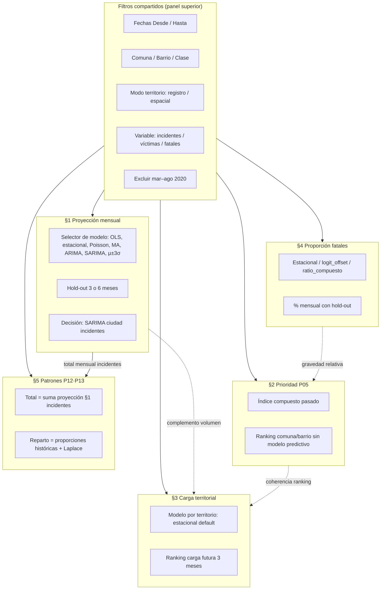
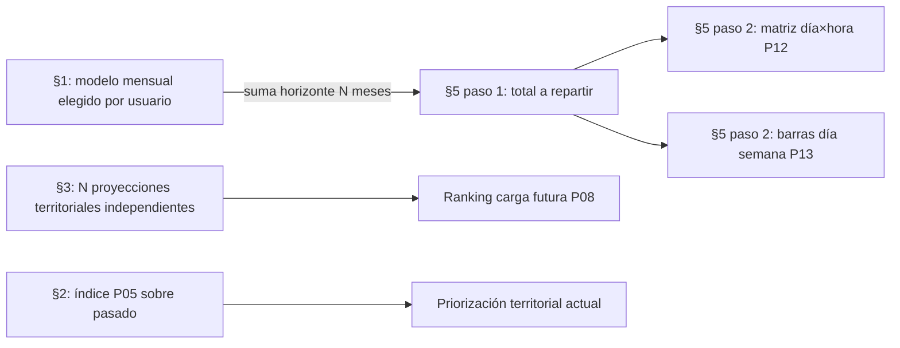
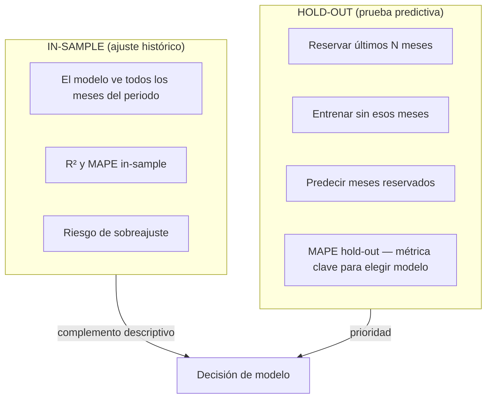
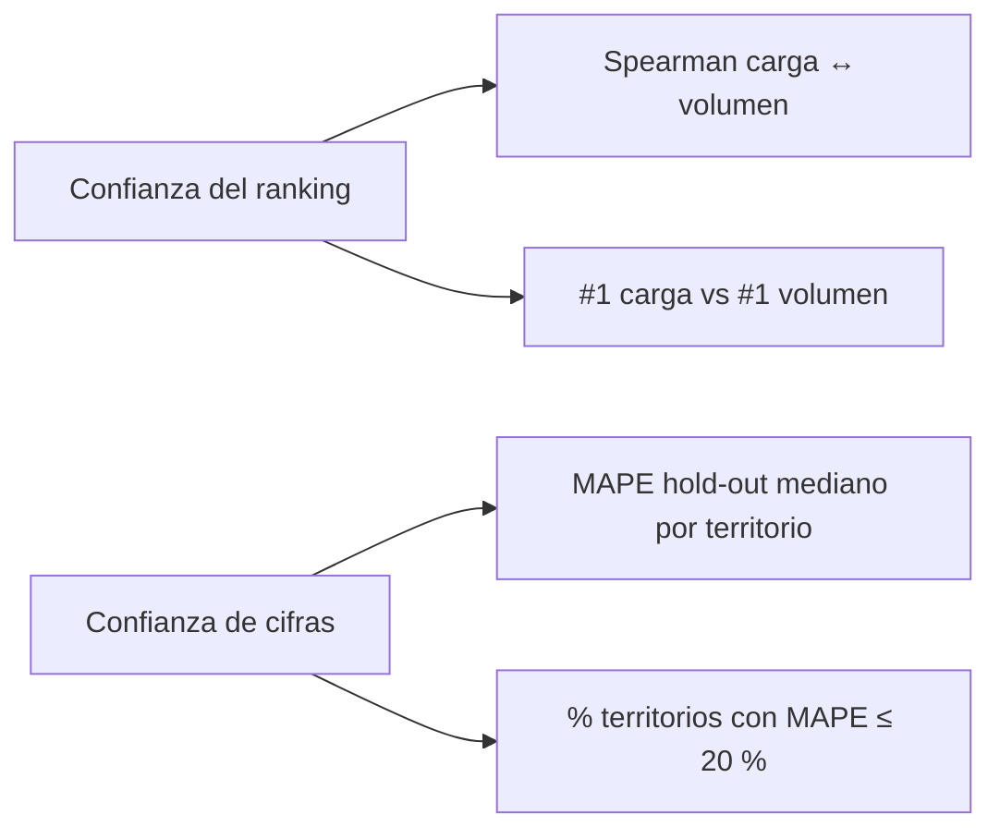
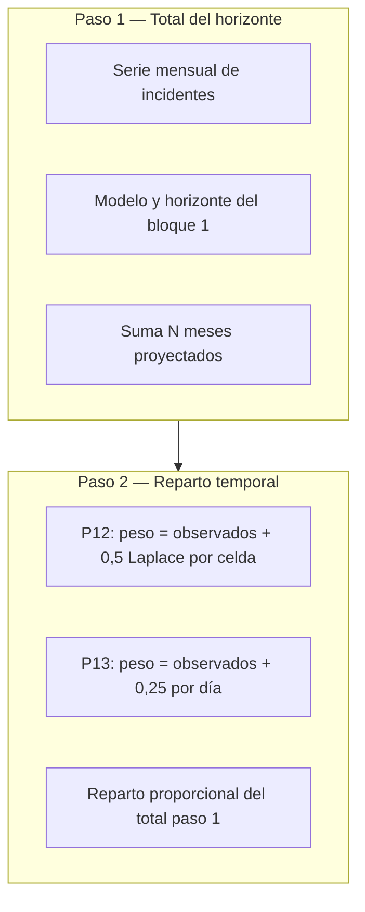
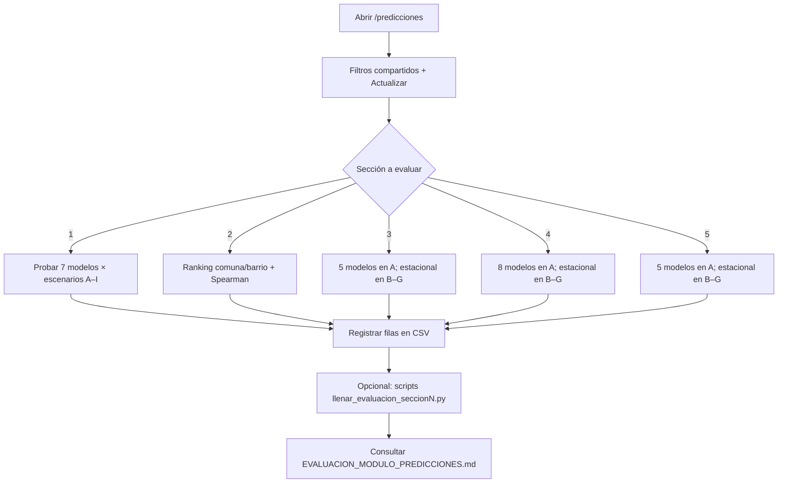

# Evaluación del módulo Predicciones — ViaData Medellín

**Proyecto:** ViaData — Medellín (Sistema de información para mitigación de accidentes de tránsito)  
**Módulo:** Tablero `/predicciones` — cinco bloques evaluados  
**Estado global:** CERRADO (2026-06-18)  
**Versión de este documento:** 2.0 — fuente única de evaluación (consolida todos los `.txt` de esta carpeta)

---

## Propósito de este documento

Este archivo es la **fuente única** de la evaluación metodológica y las decisiones de producción del módulo **Predicciones**. Integra las guías operativas (antes `LEEME_*.txt`), los actas de cierre (antes `SECCION*_CIERRE_*.txt`) y la referencia a los registros CSV. Los `.txt` de `evaluaciones/` pueden eliminarse sin pérdida de información; conservar este `.md` y los `.csv` listados al final.

**Documentación complementaria (fuera de `evaluaciones/`):**

| Audiencia | Archivo | Contenido |
|-----------|---------|-----------|
| Jurado / sustentación | `docs/GUIA_SUSTENTACION_LIBRERIAS.md` | Respuestas cortas: librerías y métodos |
| Detalle técnico | `docs/LIBRERIAS_Y_SECCIONES.md` | Pantallas, modelos, stack por sección |
| Arquitectura | `docs/DOCUMENTO_TECNICO_SISTEMA.md` | APIs, roles, despliegue |
| Repositorio | `README.md` | Inicio rápido y stack |

> La carpeta `docs/` no se sube al remoto (`.gitignore`); conserve copia local o en USB.

---

## Resumen ejecutivo

| # | Bloque UI | Pregunta que responde | Decisión adoptada | Estado |
|---|-----------|----------------------|-------------------|--------|
| 1 | Proyección mensual | ¿Cuántos incidentes habrá mes a mes? | **SARIMA** `(2,1,3)(1,1,1,12)` para incidentes ciudad; alternativa **media móvil (3 m)** | CERRADA |
| 2 | Prioridad territorial (P05) | ¿Qué territorios priorizar hoy? | **Índice compuesto fijo** 30/15/20/20/15; sin selector de modelo | CERRADA |
| 3 | Carga territorial (P08·P09/P10) | ¿Qué territorios concentrarán más carga futura? | **Estacional por territorio**, horizonte 3 meses; ranking > cifras exactas | CERRADA |
| 4 | Proporción fatales (P07) | ¿Cómo evoluciona el % de víctimas fatales? | **Estacional sobre %** (default); alternativas logit con exposición y ratio compuesto | CERRADA v1.1 |
| 5 | Patrones P12 + P13 | ¿Cuándo se concentrarían los incidentes? | **Hereda bloque 1** (total) + reparto por **patrón histórico + Laplace** | CERRADA v1.1 |

**Pendiente único del módulo:** trasladar las secciones 1–5 al informe de grado (redacción narrativa).

---

## Arquitectura del módulo y cadena de decisiones



### Cadena volumen → territorio → temporalidad



**Nota de integración:** la sección 5 **no** comparte modelo con la sección 3. El total temporal proviene exclusivamente del bloque 1 (incidentes, aunque el gráfico de §1 muestre otra variable).

---

## Criterio transversal de confiabilidad

### Interpretación adoptada (recomendada para sustentación)

| Concepto | Métrica | Umbral | Lectura |
|----------|---------|--------|---------|
| Confiabilidad predictiva ~80 % | **MAPE hold-out** | ≤ 20 % | Precisión estimada ≈ 100 % − MAPE |
| Ejemplo SARIMA ciudad (A) | MAPE prueba 12,6 % | Cumple | Precisión ~87 % |

### Interpretación alternativa (no adoptada como criterio principal)

| Concepto | Métrica | Umbral | Observación |
|----------|---------|--------|-------------|
| Explicación de variación | **R²** | ≥ 0,80 | Poco realista en series mensuales con COVID y estacionalidad |

**Cuadro A — Confiabilidad predictiva ~80 % (adoptado):** MAPE hold-out ≤ 20 % → precisión estimada ≈ 100 % − MAPE (MAPE 15 % ≈ 85 % ✓; MAPE 22 % ≈ 78 % ✗).

**Cuadro B — Explicación del 80 % de variación (no adoptado):** R² ≥ 0,80; en accidentes mensuales con COVID casi ningún modelo lo alcanza (el mejor in-sample en A es MA con R² ≈ 0,60). Si el jurado insiste en R², documentar shocks y estacionalidad y justificar el tablero como herramienta exploratoria con hold-out.

### In-sample vs hold-out



**Regla operativa:** para **elegir modelo** → priorizar MAPE hold-out. Para **describir ajuste** → usar R² / MAPE in-sample como complemento.

### Configuración estándar transversal

| Parámetro | Valor recomendado |
|-----------|-------------------|
| Periodo de referencia | 2018-01-01 — 2021-09-30 |
| Excluir mar–ago 2020 | **Sí** (obligatorio en SARIMA y % fatales) |
| Hold-out | 3 meses (6 opcional en §1 y §4) |
| Horizonte proyección | 3 meses |

---

## Sección 1 — Proyección mensual

**Estado:** CERRADA (2026-06-18)  
**Interfaz:** Predicciones → «1. Proyección mensual»  
**Registro:** `predicciones_seccion1_proyeccion_mensual.csv` (63 filas = 9 escenarios × 7 modelos)  
**Librerías:** `docs/LIBRERIAS_Y_SECCIONES.md` §3.5 sección 1 · Backend: `predicciones_mensuales.py`, `modelos_arima.py` · Frontend: Recharts, `ChartWheelZoom.jsx`

### Objetivo

Comparar siete familias de modelos (OLS, estacional, Poisson, media móvil, ARIMA, SARIMA, **μ±3σ**) sobre series mensuales y elegir el más adecuado según **validación predictiva** (hold-out), no solo ajuste al historial.

### Flujo operativo (reproducir evaluación)

1. **Filtros compartidos:** fechas, comuna, barrio, clase, territorio, variable, excluir mar–ago 2020 → «Actualizar».
2. **Controles §1:** modelo, orden ARIMA/SARIMA, horizonte, meses de prueba (3 o 6).
3. **Leer dos bloques distintos:** métricas in-sample bajo el gráfico vs panel «Prueba del modelo» (hold-out).
4. **Registrar** una fila por (escenario × modelo) en el CSV.

### Modelos evaluados

| Modelo | Mínimo de meses útiles (tras excluir COVID) |
|--------|---------------------------------------------|
| OLS | 2 |
| Estacional / Poisson | 3 (recomendado ≥ 12) |
| Media móvil | = ventana (3, 6 o 12) |
| ARIMA | 12 (+ 3 hold-out → 15 totales) |
| SARIMA | 24 (dos ciclos anuales) |
| **μ±3σ (`tres_sigma`)** | 2 (proyección = media constante; bandas de control) |

### Escenarios definidos

| ID | Rango / filtro | Propósito |
|----|----------------|-----------|
| **A** | 2018–2021, incidentes ciudad | **Decisión principal del modelo** |
| B | 2018–2021, víctimas | Misma lógica, otra variable |
| C | 2018–2021, fatales | Serie más volátil |
| D | Comuna Castilla (`comuna_id = 27`) | Territorio reducido |
| E | Clase Atropello (`clase_incidente_id = 2`) | Filtro por tipo |
| F | Sin excluir COVID | Validar exclusión mar–ago 2020 |
| G | 6 meses | Degradación con poca historia |
| H | 12 meses | Mínimo ARIMA; SARIMA inactivo |
| I | 18 meses post-COVID | Comportamiento reciente |

### Resultados clave — escenario A (hold-out 3 meses)

| Modelo | MAPE in-sample | MAPE hold-out | Precisión est. | ¿Cumple 80 %? |
|--------|----------------|---------------|----------------|---------------|
| **SARIMA** | 13,1 % | **12,6 %** | ~87 % | Sí |
| Media móvil | 6,5 % | 15,7 % | ~84 % | Sí |
| ARIMA | 11,0 % | 19,9 % | ~80 % | Límite |
| OLS | 11,2 % | 18,9 % | ~81 % | Sí |
| Poisson | 8,3 % | 22,5 % | ~78 % | No |
| Estacional | 8,4 % | 22,4 % | ~78 % | No |

**Hallazgo central:** Poisson y estacional ganan in-sample pero pierden en hold-out (sobreajuste relativo).

### Mejor hold-out por escenario

| ID | Contexto | Mejor modelo | MAPE prueba | Precisión ~ |
|----|----------|--------------|-------------|-------------|
| A | Incidentes ciudad | SARIMA | 12,6 % | 87 % |
| G | 6 meses | Poisson/MA * | 15,7 % | 84 % (*parcial) |
| H | 12 meses | Poisson | 14,4 % | 86 % |
| I | 18 meses post-COVID | Media móvil | 15,7 % | 84 % |
| B | Víctimas ciudad | Media móvil | 14,7 % | 85 % |
| C | Fatales ciudad | Estacional | 19,7 % | 80 % |
| D | Castilla | Media móvil | 8,4 % | 92 % |
| E | Atropello | Poisson | 11,6 % | 88 % |
| F | Sin excl. COVID | OLS | 11,7 % | 88 % (SARIMA 32,9 %) |

### Decisión de producción

| Elemento | Valor adoptado |
|----------|----------------|
| Modelo principal (incidentes ciudad) | **SARIMA(2,1,3)(1,1,1,12)** |
| Alternativa simple | Media móvil, ventana 3 meses |
| Excluir COVID | Sí (por defecto en UI) |
| Hold-out | 3 meses |
| Horizonte | 3 meses |

### Modelo μ±3σ (`tres_sigma`) — línea base

| Aspecto | Detalle |
|---------|---------|
| Proyección | Constante = **media (μ)** del periodo de ajuste |
| Bandas | **μ ± 3σ** del mismo periodo; marcan variación histórica esperada |
| Hold-out | MAPE sobre la media constante (comparable con otros modelos) |
| Uso adoptado | **Línea base / control**, no modelo principal; útil cuando la serie es estable o como contraste en §3 |
| CSV dedicado | `predicciones_tres_sigma_evaluacion.csv` (escenarios A, G, F en §1, §3, §5) |
| Script | `python scripts/llenar_evaluacion_tres_sigma.py` |

Columnas extra en CSV §1 para μ±3σ: `media_historica`, `desviacion_estandar`, `limite_inferior_3sigma`, `limite_superior_3sigma`, `pct_meses_dentro_3sigma`, `meses_fuera_3sigma`.

### Columnas del CSV (§1)

| Columna | Origen en UI |
|---------|--------------|
| `sin_modelo` | «no» si hay gráfico con ajuste; «si» si aviso sin proyección |
| `n_meses_ajuste` | Meses usados (sin mar–ago 2020 si aplica) |
| `r2`, `rmse`, `mape_pct` | Métricas **in-sample** (línea bajo gráfico) |
| `aic`, `bic` | Solo ARIMA / SARIMA |
| `bondad_nivel` | Caja «Interpretación del ajuste» |
| `r2_holdout`, `rmse_holdout`, `mape_holdout_pct`, `bondad_holdout` | Panel hold-out |
| `holdout_activo` | «si» si tabla mes a mes; «no» si indica motivo |
| `mape_holdout_pct` | Panel «Prueba del modelo» — **métrica clave** |
| `proyeccion_razonable` | si / no / parcial (regla abajo) |
| `media_historica` … `meses_fuera_3sigma` | Solo modelo μ±3σ |

**Regla `proyeccion_razonable` (escenarios A, G, H, I):**

| Valor | Condición |
|-------|-----------|
| **no** | Sin modelo, hold-out inactivo, o MAPE hold-out > 25 % |
| **si** | MAPE hold-out ≤ 20 % (escenario no G); μ±3σ con ≥ 90 % meses dentro de banda y MAPE ≤ 20 % |
| **parcial** | MAPE 20–25 %; escenario G (6 meses); R² ≈ 1 en I; OLS/ARIMA con R² < 0,15 pero MAPE 15–20 %; μ±3σ con pct_dentro < 85 % |

**Orden sugerido de evaluación:** A (completo) → G, H, I → B, C → D, E → F. Referencias: Castilla `comuna_id = 27`; Atropello `clase_incidente_id = 2`.

### Scripts de reproducibilidad

```bash
# Desde backend/
python scripts/llenar_evaluacion_seccion1.py
python scripts/validar_proyeccion_razonable_aghi.py
```

### Frases para informe

> Se evaluaron siete familias de modelos (incluido μ±3σ como línea base) sobre nueve escenarios de datos (rango largo, corto, variable, territorio, clase y efecto COVID), registrando métricas in-sample y validación con tres meses reservados al final del periodo.

> Se adoptó como umbral de confiabilidad exploratoria un MAPE en prueba ≤ 20 %, equivalente a una precisión estimada del 80 % en la anticipación mensual.

> Para la proyección mensual de incidentes a nivel ciudad (2018–2021, excluyendo mar–ago 2020 del ajuste), el modelo SARIMA(2,1,3)(1,1,1,12) obtuvo el menor error en prueba (MAPE 12,6 %). La media móvil de tres meses ofrece una alternativa más simple con desempeño comparable (MAPE 15,7 %).

---

## Sección 2 — Prioridad territorial (P05)

**Estado:** CERRADA (2026-06-18)  
**Interfaz:** Predicciones → «2. Prioridad territorial (índice compuesto)»  
**Registro:** `predicciones_seccion2_prioridad_territorial.csv` (7 escenarios)  
**Librerías:** `docs/LIBRERIAS_Y_SECCIONES.md` §3.5 sección 2 · Backend: `prioridad_territorial.py`

### Objetivo

Validar si el **índice compuesto P05** es útil para priorizar territorios en el periodo filtrado. **No hay elección de modelo predictivo** — la fórmula es fija y transparente.

### Flujo operativo

1. Filtros compartidos (variable superior no cambia el índice; usar incidentes).
2. Nivel comuna o barrio → «Actualizar».
3. Leer tabla + guías («Scores e índice», «¿Por qué estos pesos?»).
4. Una fila por escenario en CSV (no hay filas por modelo).

### Escenarios

| ID | Configuración | Propósito |
|----|---------------|-----------|
| A | Ciudad, comunas, 2018–2021, COVID excl. | Decisión principal |
| B | Ciudad, barrios | Granularidad barrial |
| C | 12 meses, comunas | Sensibilidad rango corto |
| D | Castilla (id 27), barrios | Intra-comuna |
| E | Atropello (id 2), comunas | Filtro por clase |
| F | Ciudad, sin excl. COVID en tendencia | Efecto shock |
| G | Ciudad, modo espacial PostGIS | vs registro |

**Orden sugerido:** A → B → C → D, E → F → G.

### Columnas del CSV (§2)

| Columna | Significado |
|---------|-------------|
| `total_territorios_elegibles` | Meta (≥ 5 comuna / ≥ 25 barrio) |
| `total_incidentes_periodo` | Meta |
| `top1_*` | Fila #1 del ranking |
| `top1_rank_frecuencia` | Posición del #1 si ordenara solo por incidentes |
| `top3_nombres` | Tres primeros (`;` separados) |
| `overlap_top5_indice_frecuencia` | Cuántos del top 5 índice están en top 5 frecuencia |
| `spearman_indice_frecuencia` | Correlación índice vs frecuencia |
| `ranking_util` | si / parcial / no |

**Regla `ranking_util`:** **si** — Spearman ≥ 0,75, #1 en top 3 frecuencia, overlap top5 ≥ 3. **parcial** — Spearman ≥ 0,5 o overlap ≥ 2 o #1 en top 5 frecuencia. **no** — resto.

### Fórmula adoptada

```
Índice = 30 %·score(Freq) + 15 %·score(Dens) + 20 %·score(Tend)
       + 20 %·score(Fatal) + 15 %·score(Part)
```

Cada `score` se normaliza 0–100 entre territorios elegibles del mismo nivel.

| Componente | Definición |
|------------|------------|
| **Freq** | Frecuencia de incidentes |
| **Dens** | Densidad incidentes/km² |
| **Tend** | Delta de promedios mensuales (no OLS del gráfico §1) |
| **Fatal** | % víctimas fatales |
| **Part** | Participación en el total del periodo |

**Tendencia (Tend):** ventana 6 meses si hay ≥ 12 meses; solo deltas ≥ 0; atenuación si el territorio está bajo el percentil 25 de frecuencia.

**Elegibilidad:** comuna ≥ 5 incidentes; barrio ≥ 25 incidentes.

### Resultados por escenario

| ID | Nivel | Top 1 | Índice | # vol. | Spearman | ranking_util |
|----|-------|-------|--------|--------|----------|--------------|
| A | comuna | La Candelaria | 62,6 | 1 | 0,85 | **si** |
| B | barrio | Sin Inf (Robledo) | 56,2 | 17 | 0,90 | **parcial** |
| C | comuna | La Candelaria | 68,6 | 1 | 0,85 | si |
| D | barrio | Caribe (Castilla) | 58,1 | 1 | 0,85 | si |
| E | comuna | La Candelaria | 75,2 | 1 | 0,88 | si |
| F | comuna | La Candelaria | 62,6 | 1 | 0,85 | si |
| G | comuna | La Candelaria | 61,3 | 1 | 0,86 | si |

**Resumen:** 6/7 escenarios `ranking_util = si`; solo B (barrios ciudad) = parcial.

### Decisión de producción

| Contexto | Uso adoptado |
|----------|--------------|
| Comunas ciudad | **Aceptado** para priorización exploratoria |
| Barrios ciudad | Aceptado con lectura complementaria (vista «Solo por frecuencia») |
| Complemento | Cruzar con §3 (carga futura) y mapa descriptivo |

### Interpretación — ejemplo La Candelaria (A)

La Candelaria encabeza por **concentración** (Freq 100, Dens 100, Part 100), no porque sea la comuna que más empeora (Tend ~5) o la más letal en términos relativos (Fatal ~8).

### Script

```bash
python scripts/llenar_evaluacion_seccion2.py
```

---

## Sección 3 — Carga proyectada territorial (P08 · P09/P10)

**Estado:** CERRADA (2026-06-18)  
**Interfaz:** Predicciones → «3. Comparación territorial de carga proyectada»  
**Registro:** `predicciones_seccion3_carga_territorial.csv` (11 filas)  
**Librerías:** `docs/LIBRERIAS_Y_SECCIONES.md` §3.5 sección 4 · Backend: `carga_esperada_territorial.py`

### Objetivo

Proyectar incidentes futuros **por territorio** (comuna P09 / barrio P10), sumar el horizonte y ordenar por **carga esperada**. La categoría alto/medio/bajo (P08) es **relativa** (terciles entre territorios listados).

### Flujo operativo

1. Filtros compartidos → §3: nivel comuna/barrio, modelo, horizonte 3 meses.
2. Leer gráfico, panel de confianza, tabla (# vol.).
3. CSV: escenario A × 6 modelos (estacional, OLS, MA, μ±3σ, ARIMA, SARIMA); B–G × estacional.

### Columnas del CSV (§3)

| Columna | Significado |
|---------|-------------|
| `ranking_coherente`, `spearman_carga_frecuencia`, `top1_rank_frecuencia` | Coherencia ranking |
| `nivel_confianza_ranking`, `nivel_confianza_cifras` | Desde `bondad_agregada` API |
| `mediana_mape_holdout_pct`, `mape_ponderado_incidentes_pct`, `mediana_mape_nucleo_pct` | Error territorial |
| `pct_territorios_holdout_aceptable` | % territorios con MAPE ≤ 20 % |
| `cierre_util` | si / parcial / no |

**Regla `cierre_util`:** **si** — ranking_coherente=si y confianza ranking bueno. **parcial** — barrios ciudad (B), ARIMA en A, o ranking moderado. **no** — ranking incoherente.

### Diferencia con otras secciones

| Sección | Enfoque temporal | Selector modelo |
|---------|------------------|-----------------|
| §1 | Una serie agregada (ciudad/filtro) | Sí — hold-out elige modelo |
| §2 | Índice del **pasado** (P05) | No |
| §3 | **N proyecciones** (una por territorio) | Sí — criterio = ranking Spearman |

### Evaluación en dos capas (panel UI)



Para P08/P09 basta un **ranking bueno** aunque las cifras absolutas tengan MAPE alto (esperable: cada comuna tiene menos datos que la serie ciudad).

### Escenario A — comparación de modelos (comunas, 22/22 proyectables)

| Modelo | Top 1 | Spearman | Conf. ranking | Conf. cifras | cierre_util |
|--------|-------|----------|---------------|--------------|-------------|
| **estacional** | La Candelaria | 0,95 | bueno | bajo | **si** |
| ols | La Candelaria | 0,96 | bueno | moderado | si |
| media_movil | La Candelaria | 0,82 | bueno | moderado | si |
| arima | Sin Inf | 0,80 | moderado | bajo | **parcial** |
| sarima | La Candelaria | 0,80 | bueno | bajo | si |

### Escenarios B–G (estacional)

| ID | Nivel | Top 1 | Spearman | cierre_util | Nota |
|----|-------|-------|----------|-------------|------|
| B | barrio | Sin Inf (Robledo) | 0,71 | parcial | 220/270 sin proyección |
| C | comuna | La Candelaria | 0,95 | si | |
| D | barrio | Caribe (Castilla) | 0,87 | si | |
| E | comuna | La Candelaria | 0,91 | si | |
| F | comuna | La Candelaria | 0,96 | si | COVID en ajuste |
| G | comuna | La Candelaria | 0,99 | si | modo espacial |

**Resumen cierre_util:** 9 filas **si**, 2 **parcial** (A/ARIMA, B/barrios ciudad).

### Decisión de producción

| Elemento | Valor |
|----------|-------|
| Modelo default | **Estacional** por territorio |
| Horizonte | 3 meses |
| Excluir COVID | Sí |
| Uso | Ranking comparativo; **no** presupuesto exacto |
| No adoptar | ARIMA territorial (reordena líder) |

### Hallazgos

- Spearman carga↔volumen ≥ 0,80 en comunas; alineado con P05 (La Candelaria líder en ambos).
- MAPE mediano hold-out ~33 % (estacional, A); solo ~23 % territorios ≤ 20 %.
- Barrios: alta proporción sin modelo (220/270); uso parcial con aviso UI.

### Script

```bash
python scripts/llenar_evaluacion_seccion3.py
```

---

## Sección 4 — Proporción víctimas fatales (P07)

**Estado:** CERRADA v1.1 (2026-06-18)  
**Interfaz:** Predicciones → «4. Proporción de víctimas fatales»  
**Registro:** `predicciones_seccion4_proporcion_fatales.csv` (14 filas)  
**Librerías:** `docs/LIBRERIAS_Y_SECCIONES.md` §3.5 sección 3 · Backend: `proporcion_fatales_mensual.py`

### Objetivo

Evaluar si el tablero puede mostrar la evolución del **% de víctimas fatales** mes a mes (fatales ÷ víctimas × 100) con criterio documentado. Pregunta de **gravedad relativa**, no de conteo absoluto.

### Flujo operativo

1. Filtros referencia: ciudad, 2018–2021, excluir COVID.
2. Escenario A: probar 8 modelos; B–G solo estacional.
3. Registrar R², MAPE ajuste, MAPE prueba, `proyeccion_razonable`.

### Escenarios (§4)

| ID | Configuración | Modelos |
|----|---------------|---------|
| A | Ciudad 2018–2021, COVID excl. | 8 modelos |
| B | Comuna Castilla | estacional |
| C | Clase Atropello | estacional |
| D | Solo 12 meses | estacional |
| E | Sin excluir COVID | estacional |
| F | Territorio espacial (PostGIS) | estacional |
| G | 18 meses post-COVID | estacional |

### Columnas del CSV (§4)

| Columna | Significado |
|---------|-------------|
| `n_meses_ajuste`, `pct_promedio_observado`, `pct_promedio_horizonte` | Contexto |
| `r2`, `mape_pct`, `mape_holdout_pct`, `holdout_activo` | Métricas |
| `bondad_nivel`, `proyeccion_razonable`, `notas` | Evaluación |

**Criterio util (A):** **sí** si MAPE prueba ≤ 20 % en modelos principales, o R² moderado con MAPE ajuste ≤ 20 %. No exigir R² alto (serie muy volátil).

### Mejoras v1.1 incorporadas

- Ajuste sobre el % real (sin redondeo a enteros)
- Hold-out en API y UI
- Modelos `logit_offset` y `ratio_compuesto`
- Bandas aproximadas en proyección (±1,96×RMSE)
- Modelos avanzados tras checkbox en UI

### Modelos evaluados — escenario A (ciudad, 39 meses ajuste)

| Modelo | R² | MAPE ajuste | MAPE prueba | util |
|--------|-----|-------------|-------------|------|
| **estacional** | 0,38 | 16,5 % | 22,0 % | **sí** |
| **logit_offset** | 0,36 | 15,2 % | **20,3 %** | **sí** |
| **ratio_compuesto** | 0,38 | 16,1 % | 21,2 % | **sí** |
| media_movil | 0,32 | 17,0 % | 35,1 % | no |
| ols | 0,01 | 21,8 % | 36,5 % | no |
| arima / sarima | ~0 | >24 % | >28 % | no |

**Referencia:** % observado medio ~**0,66 %** (rango 0,35–1,2 %).

### Decisión de producción

| Situación | Qué hacer |
|-----------|-----------|
| Ciudad, uso general | **Estacional** (default); logit o ratio para comparar |
| Comuna o clase filtrada | Solo exploración; error en prueba suele subir |
| < 24 meses útiles | Ampliar fechas; no confiar en proyección |
| Sin excluir COVID | No usar |

**Resumen util (14 filas):** 6 sí · 2 parcial · 6 no

### Script

```bash
python scripts/llenar_evaluacion_seccion4.py
```

---

## Sección 5 — Patrones temporales (P12 · P13)

**Estado:** CERRADA v1.1 (2026-06-18)  
**Interfaz:** Predicciones → bloque 5 (`PatronesDiaHoraPanel.jsx`)  
**Registro:** `predicciones_seccion5_patrones_temporales.csv` (11 filas)  
**Backend:** `dashboard/patrones_temporales_proyectados.py`  
**Librerías:** `docs/LIBRERIAS_Y_SECCIONES.md` §3.5 secciones 5–6

### Objetivo

Indicar **cuándo** del horizonte proyectado se concentrarían los incidentes:

- **P12:** matriz día × hora (168 celdas: 7 × 24)
- **P13:** barras por día de la semana (resumen de P12)

### Flujo operativo

1. Filtros + bloque 1 con modelo/horizonte deseados.
2. Revisar bloque 5: heatmap P12 (periodo / proyección / diferencia).
3. Revisar P13: barras observado vs proyección y chips por día.
4. Producción: un solo modelo en bloque 1; bloque 5 sigue automático.

### Columnas clave del CSV (§5)

| Columna | Significado |
|---------|-------------|
| `total_incidentes_periodo` | Base del reparto histórico |
| `total_proyectado_horizonte` | Suma meses proyectados (depende del modelo en fila) |
| `p12_top_celda`, `p12_spearman_obs_proy`, `p12_top_igual_obs`, `p12_coherente` | P12 |
| `p13_top_dia`, `p13_top_participacion_pct`, `p13_top_nivel` | P13 |
| `patron_util`, `sin_modelo_mensual` | Evaluación operativa |

**Regla `patron_util`:** **sí** — total proyectado, reparto coherente, patrón legible. **parcial** — datos escasos, COVID no excluido, o líder horario ≠ histórico (ej. C). **no** — sin modelo mensual o patrón inutilizable.

### Metodología en dos pasos



**Importante:** el paso 2 **no** depende del modelo mensual; solo del periodo filtrado (proporciones históricas).

### Decisión UI v1.1

| Elemento | Comportamiento |
|----------|----------------|
| Selector de modelo en §5 | **Eliminado** — hereda bloque 1 |
| Variable para total | Siempre **incidentes** (aunque §1 muestre víctimas/fatales) |
| Cambiar volumen a repartir | Usuario ajusta modelo/horizonte en §1 |

### Resultados ciudad — escenario A (5 modelos en CSV, solo documentación)

| Modelo | Total proyectado | P12 líder | P13 líder | patron_util |
|--------|------------------|-----------|-----------|-------------|
| estacional | 5 531 | Martes 07:00 | Martes | sí |
| ols | 5 377 | Martes 07:00 | Martes | sí |
| media_movil | 5 189 | Martes 07:00 | Martes | sí |
| arima | 4 756 | Martes 07:00 | Martes | sí |
| sarima | 4 573 | Martes 07:00 | Martes | sí |

- Spearman observado vs proyectado por celda ~**0,999**
- Los modelos **no desempatan** el patrón relativo; solo cambian `total_proyectado_horizonte`
- `p13_top_nivel = bajo` en A (martes ~15 % vs 14,29 % uniforme)

### Otros escenarios (estacional)

| ID | patron_util | Comentario |
|----|-------------|------------|
| B | sí | Castilla; líder martes 06:00 |
| C | sí | Atropello; P12 miércoles 18:00 ≠ líder horario histórico* |
| D | sí | 12 meses; mismo líder ciudad |
| E | **parcial** | Sin excluir COVID |
| F | sí | PostGIS ≈ registro |
| G | sí | 18 meses post-COVID |

**Resumen patron_util:** 10 sí · 1 parcial · 0 no

### Semáforo P13 (solo periodo observado)

Referencia: reparto uniforme teórico = 100 % ÷ 7 ≈ **14,29 %/día**

| ratio = participación ÷ 14,29 | Nivel |
|-------------------------------|-------|
| ≥ 1,45 | alto |
| ≥ 1,12 | medio |
| resto | bajo |

### Límites aceptados

- No modela serie propia por celda
- Asume que el futuro repite proporciones del periodo filtrado
- No usar cifras de celda como presupuesto exacto

### Script

```bash
python scripts/llenar_evaluacion_seccion5.py
```

---

## Matriz de relaciones entre secciones

| Pregunta | §1 | §2 | §3 | §4 | §5 |
|----------|----|----|----|----|-----|
| ¿Cuántos incidentes al mes? | ✓ | | | | total → |
| ¿Qué territorio priorizar hoy? | | ✓ | | % en índice | |
| ¿Qué territorio concentrará carga futura? | complemento | coherencia | ✓ | | |
| ¿Qué tan grave es el % fatales? | conteo C | componente Fatal | | ✓ | |
| ¿Cuándo ocurren los incidentes? | modelo+horizonte | | | | ✓ |

---

## Cierre global del módulo (2026-06-18)

Las cinco secciones del tablero `/predicciones` quedaron evaluadas y cerradas.

**Cadena volumen → reparto:**

- §1 → total mensual (modelo elegido por usuario).
- §3 → reparto territorial (modelo propio estacional por territorio).
- §5 → reparto temporal día×hora y día semana (patrón histórico + total de §1).

**Pendiente único:** redactar secciones 1–5 en el informe de grado (narrativa + tablas/gráficos del escenario A).

---

## Archivos que permanecen en `evaluaciones/`

Tras consolidar en este documento, la carpeta puede contener **solo** estos archivos:

| Archivo | Rol |
|---------|-----|
| **`EVALUACION_MODULO_PREDICCIONES.md`** | Fuente única — guías, cierres y decisiones |
| `predicciones_seccion1_proyeccion_mensual.csv` | Registro numérico §1 |
| `predicciones_seccion2_prioridad_territorial.csv` | Registro §2 |
| `predicciones_seccion3_carga_territorial.csv` | Registro §3 |
| `predicciones_seccion4_proporcion_fatales.csv` | Registro §4 |
| `predicciones_seccion5_patrones_temporales.csv` | Registro §5 |
| `predicciones_tres_sigma_evaluacion.csv` | Registro μ±3σ (§1, §3, §5) |

**Archivos `.txt` eliminables** (contenido ya en este `.md`):  
`LEEME_evaluacion_predicciones.txt`, `LEEME_evaluacion_seccion2_prioridad.txt`, `LEEME_evaluacion_seccion3_carga_territorial.txt`, `LEEME_evaluacion_seccion4_proporcion_fatales.txt`, `LEEME_evaluacion_seccion5_patrones_temporales.txt`, `LEEME_DOCUMENTACION.txt`, `SECCION1_CIERRE_PROYECCION_MENSUAL.txt`, `SECCION2_CIERRE_PRIORIDAD_TERRITORIAL.txt`, `SECCION3_CIERRE_CARGA_TERRITORIAL.txt`, `SECCION4_CIERRE_PROPORCION_FATALES.txt`, `SECCION5_CIERRE_PATRONES_TEMPORALES.txt`.

### Scripts de evaluación (`backend/scripts/`)

| Script | Sección |
|--------|---------|
| `llenar_evaluacion_seccion1.py` | 1 (+ `validar_proyeccion_razonable_aghi.py`) |
| `llenar_evaluacion_seccion2.py` | 2 |
| `llenar_evaluacion_seccion3.py` | 3 |
| `llenar_evaluacion_seccion4.py` | 4 |
| `llenar_evaluacion_seccion5.py` | 5 |
| `llenar_evaluacion_tres_sigma.py` | μ±3σ (§1, §3, §5) |
| `llenar_evaluacion_todas_secciones.py` | Orquestador |

---

## Flujo de trabajo recomendado para reproducir la evaluación



**Orden sugerido §1:** A (completo) → G, H, I (rangos) → B, C → D, E → F

---

## Limitaciones transversales (documentadas)

1. Las proyecciones son **escenarios orientativos** para planificación; no sustituyen análisis causal ni intervalos de confianza formal completos.
2. Con **menos de 12 meses** de historia, ARIMA/SARIMA no aplican o no son fiables.
3. **Excluir mar–ago 2020** es imprescindible para SARIMA ciudad, % fatales y coherencia general.
4. A nivel **barrio**, muchos territorios carecen de serie suficiente (§3: 220/270 sin proyección).
5. Las **cifras absolutas** territoriales tienen MAPE alto; priorizar **rankings** y lectura relativa.
6. §5 asume **estacionariedad del patrón temporal** respecto al periodo filtrado.

---

## Mejoras futuras (fuera de cierre, opcionales)

| Área | Propuesta |
|------|-----------|
| §3 | Modelo de reparto proporcional (proyección ciudad §1 × participación histórica) |
| §3 | Umbrales mínimos más altos para barrios |
| UI §1 | Default SARIMA para incidentes ciudad |
| UI §5 | Aviso si §1 muestra variable ≠ incidentes |
| General | Modelos jerárquicos bayesianos (más datos, más complejidad) |

---

## Glosario breve

| Término | Significado |
|---------|-------------|
| **Hold-out** | Validación reservando los últimos N meses; entrenar sin ellos y predecirlos |
| **MAPE** | Error porcentual absoluto medio |
| **P05** | Índice compuesto de prioridad territorial |
| **P07** | Proporción de víctimas fatales |
| **P08** | Categoría relativa de carga (terciles) |
| **P09/P10** | Proyección por comuna / barrio |
| **P12** | Matriz día × hora proyectada |
| **P13** | Distribución por día de la semana |
| **Spearman** | Correlación de rangos; mide coherencia del ordenamiento |
| **μ±3σ** | Media histórica + bandas de control (3 desviaciones estándar) |
| **Laplace** | Suavizado bayesiano mínimo para evitar pesos cero |

---

## Control de versiones de este documento

| Versión | Fecha | Cambio |
|---------|-------|--------|
| 1.0 | 2026-06-18 | Unificación inicial de evaluaciones/ en Markdown |
| 2.0 | 2026-06-19 | Fuente única: guías LEEME, cierres, μ±3σ, flujos operativos y reglas CSV; `.txt` eliminables |

---

*Documento consolidado de `evaluaciones/`. Los registros numéricos viven en los CSV; la metodología y decisiones en este archivo.*
