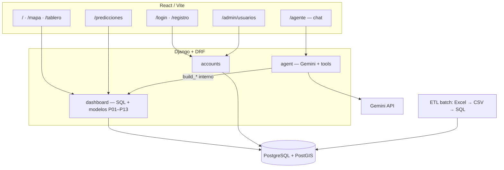

# Guía de sustentación — preparación integral

**Uso:** ensayo oral, respuestas al jurado, demostración en vivo, material de apoyo el día de la sustentación.  
**Última actualización:** 2026-06-19  

Este documento es **autocontenido** junto con la documentación oficial del proyecto:

| Documento | Para qué |
|-----------|----------|
| `DOCUMENTO_TECNICO_SISTEMA.md` | Memoria técnica: arquitectura, modelos, APIs, agente |
| `MANUAL_INSTALACION_EJECUCION.md` | Clonar, configurar, ejecutar, portabilidad |
| `MANUAL_CARGA_DATOS_BD.md` | ETL Mede, PostGIS, polígonos |
| `LIBRERIAS_Y_SECCIONES.md` | Librerías y funciones por pantalla |
| `GUIA_SUSTENTACION_LIBRERIAS.md` | Respuestas cortas: “¿qué librería?” / “¿cómo lo hizo?” |
| `CIERRE_PROYECTO.md` | Alcance final, módulos cerrados, pendientes tesis |
| `evaluaciones/EVALUACION_MODULO_PREDICCIONES.md` | Evaluación cerrada Predicciones §1–§5 |
| **Este archivo** | Mensaje al jurado, demo, fórmulas, FAQ |

---

## Tabla de contenidos

1. [Mensaje central](#1-mensaje-central-30-segundos)  
2. [Objetivos del grado](#2-objetivos-del-grado)  
3. [Tecnologías y justificación](#3-tecnologías-y-justificación)  
4. [Demo sugerida](#4-demo-sugerida-8-12-minutos)  
5. [Inventario funcional](#5-inventario-funcional)  
6. [Fórmulas e interpretación](#6-fórmulas-e-interpretación)  
7. [Modelos predictivos — qué decir al jurado](#7-modelos-predictivos--qué-decir-al-jurado)  
8. [Datos y trazabilidad](#8-datos-y-trazabilidad)  
9. [Preguntas difíciles (FAQ)](#9-preguntas-difíciles-faq)  
10. [Arquitectura en una diapositiva](#10-arquitectura-en-una-diapositiva)  
11. [Checklist el día anterior](#11-checklist-el-día-anterior)  
12. [Referencias rápidas para citar](#12-referencias-rápidas-para-citar)

---

## 1. Mensaje central (30 segundos)

> Construimos un **sistema web** que organiza la accidentalidad de Medellín a partir de datos abiertos Mede, la muestra en un **mapa** y un **tablero descriptivo** accesibles sin cuenta, incorpora un **asistente en lenguaje natural** (Gemini API) que consulta los mismos datos del backend mediante herramientas controladas, y ofrece **proyecciones mensuales y priorización territorial** a **analistas autenticados** (en `/predicciones`, reportes imprimibles y también en el asistente). Un rol **administrador** gestiona usuarios en `/admin/usuarios`. La capa de datos usa **PostgreSQL con PostGIS**; las proyecciones numéricas son **modelos estadísticos transparentes** (tendencia, estacionalidad, Poisson, media móvil, **μ±3σ**, **ARIMA/SARIMA**); el LLM **redacta y orquesta**, no inventa cifras. Para incidentes a nivel ciudad, la evaluación cerrada adoptó **SARIMA(2,1,3)(1,1,1,12)** con validación **hold-out** (MAPE ≤ 20 % ≈ 80 % de precisión estimada). **No afirmamos causalidad** ni probabilidad individual de sufrir un accidente.

---

## 2. Objetivos del grado

| Objetivo típico (proyecto USB) | Cómo lo cumple el sistema |
|--------------------------------|---------------------------|
| Arquitectura y modelo geoespacial | PostGIS, geometría `ubicacion`, polígonos comuna/barrio, parámetro `territorio=registro\|espacial` |
| Análisis temporal, territorial, por actor y gravedad | Tablero (KPIs, series, matrices, tops) + mapa (densidad, G03, P14) |
| Tablero de monitoreo | Ruta `/tablero` con filtros y comparación interanual |
| Componente predictivo / priorización | `/predicciones` (P01–P13, P05 índice compuesto) |
| Consulta en lenguaje natural | `/agente` — Gemini + tool calling sobre APIs existentes |
| Gestión de usuarios (admin) | `/admin/usuarios` — CRUD roles ciudadano / analista / administrador |
| Validación técnica | Suite `pytest` (dashboard + agent + admin API), carga reproducible ETL |

**Alcance explícitamente omitido** (decisión de cronograma, no “falla”):

| ID | Motivo |
|----|--------|
| P11 ranking vía / punto crítico | Mede no alimenta catálogos `via` / `punto_critico` |
| G04 buffer punto crítico | Tabla `punto_critico` vacía |
| G05 filtro bbox mapa | Redundante con comuna/barrio |
| P15 / F6 ML espacial | Sin tiempo; modelos parsimoniosos en v1 |
| Ingesta automática diaria | ETL manual documentado; trabajo futuro |

---

## 3. Tecnologías y justificación

| Tecnología | Por qué se eligió |
|------------|-------------------|
| **Django + DRF** | Monolito maduro: auth, migraciones parciales, API JSON estable para React |
| **PostgreSQL + PostGIS** | Estándar en SIG con SQL; `ST_Contains`, índices GIST, agregaciones espaciales |
| **React + Vite** | SPA modular; HMR en desarrollo; ecosistema Leaflet/Recharts |
| **react-zoom-pan-pinch** | Zoom visual en gráficos de predicciones/tablero (rueda, sin alterar datos) |
| **JWT (Simple JWT)** | SPA en otro origen; sesión corta (15 min access); refresh sin estado en servidor |
| **pandas** | Mismas reglas de limpieza que documenta la memoria; reproducibilidad ETL |
| **Leaflet** | Mapas ligeros, heatmap y clusters sin licencia obligatoria de proveedor comercial |

**IA en el producto:** Google **Gemini 2.5 Flash / Flash-Lite** (API gratuita) como capa de diálogo; los números salen de `dashboard/`, no de alucinación del modelo.

**No usamos en producción:** microservicios, colas de mensajes, modelos de ML espacial, gemelo digital de tráfico, LLM on-premise.

---

## 4. Demo sugerida (8–12 minutos)

| Orden | Ruta | Qué mostrar | Mensaje clave |
|-------|------|-------------|---------------|
| 1 | `/` | Filtros fecha/comuna; puntos; toggle P14 servidor; panel G03; registro vs espacial | “Dónde ocurre y si el barrio del Excel coincide con el polígono oficial” |
| 2 | `/tablero` | KPIs, evolución mensual, matriz día×hora, ranking comunas | “Cuánto, cómo cambió vs el año anterior, en qué días y horas” |
| 3 | `/agente` | Pregunta histórica sin login; luego login analista y pregunta predictiva | “El asistente usa las mismas APIs; predicciones solo con rol analista” |
| 4 | `/registro` → `/login` | Usuario **analista**; opcional **admin** (`admin` / `AdminUSB2026!`) | Roles, JWT y gestión de usuarios |
| 5 | `/predicciones` | **SARIMA** vs estacional vs **μ±3σ** en §1; panel hold-out; P05 prioridad; P07 % fatales; **rueda del mouse** en gráficos; **Generar reporte** (pie en cada hoja) | “Proyección con validación hold-out; ranking territorial; no causalidad” |
| 6 | `/admin/usuarios` (opcional) | Listar, crear, editar roles | Solo rol administrador |
| 7 | (opcional) pgAdmin o terminal | `SELECT COUNT(*) FROM incidente` | Trazabilidad: datos reales cargados con ETL |

**Antes de la demo:** crear usuario analista (o usar `admin`); definir `GEMINI_API_KEY` en `.env`; ampliar rango de fechas si KPIs salen bajos (recomendado 2018–2021); cerrar procesos duplicados en puerto 8000; probar zoom en gráficos (rueda, sin cambiar fechas).

---

## 5. Inventario funcional

### 5.1 Inicio — mapa (`/`)

| Función | ID | Descripción |
|---------|-----|-------------|
| Puntos de incidentes | — | Lat/lon; límite API hasta 100 000 |
| Heatmap / clusters | — | Agregación en cliente (Leaflet) |
| Hotspots servidor | **P14** | Cuadrícula `ST_SnapToGrid` o ranking de celdas |
| Densidad territorial | **G01–G02** | Incidentes / km² vs referencia ciudad |
| Calidad territorio | **G03** | % coincidencia comuna/barrio registro vs espacial |
| Ranking celdas calientes | **G06** | Top celdas por conteo |
| Modo territorio | **F3** | `territorio=registro` o `espacial` en todas las APIs |

### 5.2 Tablero (`/tablero`) — público

| Bloque | Contenido |
|--------|-----------|
| KPIs | Incidentes, víctimas, fatales, tasa/día, variación % vs año anterior |
| Evolución mensual | Serie + año anterior superpuesto |
| Día de semana | Participación % (no “probabilidad”) |
| Matriz día × hora | Periodo vs mismo rango año anterior; **diferencia** por celda |
| Clase de incidente | Distribución comparada |
| Rankings | Sexo, edad, condición, comuna, barrio (`top_n`) |

### 5.3 Predicciones (`/predicciones`) — analista o administrador

| ID | Nombre | Contenido |
|----|--------|-----------|
| P01–P04 | Proyección mensual (§1) | `ols`, `estacional`, `poisson`, `media_movil`, **`tres_sigma` (μ±3σ)**, **`arima`**, **`sarima`**; variables incidentes / víctimas / fatales; **hold-out** 3 o 6 meses; zoom visual en gráfico (`ChartWheelZoom`) |
| P05 | Prioridad territorial (§2) | Índice 0–100 por comuna o barrio; pesos 30/15/20/20/15; vista «solo frecuencia» |
| P06 | Desglose por clase | Proyección por `clase_incidente` |
| P07 | Proporción fatales (§4) | Serie mensual % fatales; modelos `estacional` (default), `logit_offset`, `ratio_compuesto`, `media_movil`, `ols`, `logistica`, `arima`, `sarima` |
| P08 | Carga esperada territorial (§3) | Clasificación alto/medio/bajo; ranking por carga futura 3 meses |
| P09–P10 | Carga espacial | Series territoriales proyectadas (estacional default) |
| P12 | Matriz día×hora proyectada (§5) | Hereda total y modelo del §1; reparto por patrón histórico + Laplace |
| P13 | Día semana proyectado | Incluido en bloque §5; semáforo vs reparto uniforme (14,29 %/día) |

**Decisiones de evaluación (2026-06-18, ver `evaluaciones/EVALUACION_MODULO_PREDICCIONES.md`):**

| Bloque | Modelo / decisión adoptada |
|--------|----------------------------|
| §1 incidentes ciudad | **SARIMA(2,1,3)(1,1,1,12)**; alternativa media móvil 3 m |
| §2 P05 | Índice compuesto fijo; comunas referencia |
| §3 carga territorial | Estacional por territorio; ranking > cifras exactas |
| §4 % fatales | Estacional sobre %; alternativas logit con exposición y ratio compuesto |
| §5 patrones | Hereda §1 (sin selector propio); patrón relativo estable |

### 5.4 Asistente (`/agente`) — público con predicciones condicionadas

| Función | Detalle |
|---------|---------|
| Chat en español | `POST /api/agent/chat/` — modelos Flash / Flash-Lite |
| Herramientas históricas | KPIs, tops, evolución, distribuciones, patrones (sin login) |
| Herramientas predictivas | Proyección mensual, prioridad territorial, carga esperada (solo JWT analista) |
| Caché | Servidor (`AGENT_CACHE_TTL`) + historial `localStorage` en el navegador |
| Gestión caché local | **Borrar historial en caché** y **Exportar reporte** (`.txt` con Q&A guardadas) |
| Avisos ampliados | Rango de fechas en BD; horizonte máx. 12 meses (predicciones); mínimos ARIMA/SARIMA |
| Fallback | Si un modelo Gemini agota cuota (429), prueba el otro automáticamente |
| Avisos UI | Límite de consultas, política Google tier gratuito, alcance por rol |

**Pregunta demo (analista):** *“De los próximos 6 meses, ¿cuál tiende a aumentar los incidentes y en qué sector?”*

### 5.5 Reportes — analista o administrador

| Función | Detalle |
|---------|---------|
| Acceso | Botón *Generar reporte* en tablero, mapa y predicciones → **`/reporte/vista`** |
| Tipos | Tablero, mapa (con captura html2canvas), predicciones (gráficos + tablas debajo) |
| Salida | Vista previa imprimible; PDF vía impresión del navegador |
| Pie de página | Título del reporte y numeración en **cada hoja** (`ReportePrintLayer.jsx` + CSS `@media print`) |
| API | `POST /api/reportes/tablero/`, `/mapa/`, `/predicciones/` |

### 5.6 Autenticación y roles

| Rol | Tablero / Mapa / Asistente | Predicciones / Reportes | Gestión usuarios |
|-----|----------------------------|-------------------------|------------------|
| Sin login | Sí | No | No |
| Ciudadano | Sí | No | No |
| Analista | Sí | Sí | No |
| **Administrador** | Sí | Sí | Sí (`/admin/usuarios`) |

| Función | Detalle |
|---------|---------|
| Registro | Rol `ciudadano` o `analista`; teléfono Colombia +57 |
| Login | Access JWT (~15 min) + refresh (~7 días) |
| Recuperación | Token de un uso; enlace vía WhatsApp (`wa.me`) |
| Autorización API | `IsAnalista` (incluye admin) en predicciones; `IsAdministrador` en `/api/admin/usuarios/` |
| Autorización UI | `RequireAnalista` en `/predicciones`; `RequireAdministrador` en `/admin/usuarios` |
| Demo admin | Usuario `admin` / `AdminUSB2026!` (migración `accounts/0005_seed_admin_user.py`) |

---

## 6. Fórmulas e interpretación

### 6.1 KPIs del tablero

- **Total incidentes:** \(\text{COUNT(DISTINCT incidente.id)}\) en \([desde, hasta]\).
- **Total víctimas:** \(\text{COUNT(victima.id)}\).
- **Víctimas fatales:** conteo con regla sobre catálogo `gravedad_victima` (fatal, muerte, etc.).
- **Tasa incidentes/día:** \(\dfrac{\text{total incidentes}}{\text{días del rango}}\).
- **Variación % vs año anterior:** \(\dfrac{Y_{actual} - Y_{anterior}}{Y_{anterior}} \times 100\) (si \(Y_{anterior}=0\) → no definido).

### 6.2 Día de la semana (tablero)

- **Participación** del día \(d\): \(100 \times n_d / \sum_k n_k\).
- **Ratio vs reparto uniforme:** participación / (100/7).
- **Importante:** es distribución de **frecuencia observada**, no probabilidad de que una persona tenga un accidente ese día.

### 6.3 Densidad G01–G02

\[
\text{densidad} = \frac{\text{número de incidentes}}{\text{área (km}^2\text{)}}
\]

Área desde geometría oficial (`ST_Area` en geography).

### 6.4 Calidad G03

\[
\text{G03} = 100 \times \frac{\#\{\text{incidentes con comuna registro} = \text{comuna espacial}\}}{\text{total incidentes}}
\]

Espacial: `ST_Contains(polígono_comuna, punto_incidente)`.

### 6.5 Hotspots P14

Agregación en cuadrícula métrica (EPSG:3857) con `ST_SnapToGrid` o clustering DBSCAN según endpoint. Permite ver **concentración** sin mostrar cada punto.

---

## 7. Modelos predictivos — qué decir al jurado

### 7.1 Naturaleza de las proyecciones

- Se proyectan **conteos mensuales agregados** (incidentes, víctimas o fatales).
- Se asume que el **patrón histórico filtrado** se prolonga (tendencia + estacionalidad).
- **No** incluyen variables exógenas (clima, políticas, cambios de definición, movilidad post-COVID permanente).

En la literatura de seguridad vial, los conteos se modelan con regresión de Poisson o binomial negativa cuando hay sobredispersión (Lord & Mannering, 2010; Washington et al., 2020). Este proyecto implementa variantes **didácticas y comparables** en la UI.

### 7.2 OLS lineal (`modelo=ols`) — P01

\[
Y_t = a + b \cdot t
\]

- \(t = 0,1,\ldots,n-1\) índice mensual en el periodo de ajuste.
- Proyección: \(\hat{Y}_{n+k} = a + b(n+k-1)\), truncado a \(\geq 0\).

**Por qué existe:** línea base fácil de explicar; muestra que ignorar estacionalidad suele dar R² bajo en Mede.

### 7.3 Modelo estacional (`modelo=estacional`) — P02

\[
Y_t = \beta_0 + \beta_1 t + \sum_{m=2}^{12} \gamma_m \mathbf{1}_{\text{mes}=m} \; (+ \delta_{\text{año}} \text{ si hay ≥2 años y ≥18 meses})
\]

**Por qué importa:** picos de fin de año y mitad de año en Mede; buen in-sample pero en la evaluación ciudad (A) **pierde frente a SARIMA en hold-out** (MAPE ~22 % vs ~12,6 %). Sigue siendo default útil en **§3 territorial** y **§4 % fatales**.

### 7.4 Poisson log-lineal (`modelo=poisson`) — P04

\[
\mathbb{E}[Y_t] = \exp\left(\beta_0 + \beta_1 t + \sum_{m=2}^{12} \gamma_m \mathbf{1}_{\text{mes}=m} + \cdots\right)
\]

**Por qué Poisson:** los conteos son enteros no negativos; la literatura de accidentalidad usa modelos de conteo (Lord & Mannering, 2010). Si el algoritmo IRLS no converge, la API usa fallback estacional (`fallback_estacional: true` en meta).

### 7.5 Media móvil (`modelo=media_movil`)

\[
\hat{Y}_{\text{futuro}} = \frac{1}{w}\sum_{i=0}^{w-1} Y_{n-i}
\]

Benchmark simple; alternativa adoptada en escenario A cuando se busca **menor complejidad** (MAPE hold-out ~15,7 % con ventana 3 m).

### 7.6 Criterio μ±3σ (`modelo=tres_sigma`)

\[
\hat{Y}_{\text{futuro}} = \mu = \frac{1}{n}\sum_{t=1}^{n} Y_t, \quad \text{bandas} = \mu \pm 3\sigma
\]

- **Biblioteca:** NumPy (`mean`, `std`) en `predicciones_mensuales.py`.
- **Proyección:** constante = media del periodo de ajuste.
- **Bandas:** delimitan variación histórica; meses fuera de banda = atípicos en el gráfico.
- **Al jurado:** “Línea base interpretable: asume que el futuro cercano se parece al promedio reciente; útil para comparar con modelos más elaborados y como referencia en carga territorial.”
- **No es el modelo principal** para incidentes ciudad (SARIMA gana en hold-out); sí complemento didáctico y control.

### 7.7 ARIMA y SARIMA (`modelo=arima` | `modelo=sarima`)

- **Biblioteca:** `statsmodels` (`modelos_arima.py`).
- **ARIMA** — mínimo **12 meses** de historia en el ajuste; orden editable en UI (default 2,1,3).
- **SARIMA** — mínimo **24 meses** (dos ciclos anuales); default **(2,1,3)(1,1,1,12)**.
- **Adoptado (evaluación §1, escenario A):** SARIMA para **incidentes ciudad** — MAPE hold-out **12,6 %** (~87 % precisión estimada).
- **Recomendado para:** conteos mensuales agregados; **no** como primera opción en **% fatales (P07)**.
- **Al jurado:** “Complementamos modelos interpretables con series temporales clásicas; **elegimos modelo por MAPE en prueba (hold-out)**, no solo por R² in-sample.”

### 7.8 Exclusión COVID

Meses **2020-03 … 2020-08** excluidos **solo del ajuste** si `excluir_covid=1`. Motivo: confinamiento atípico. Los observados siguen en el gráfico.

### 7.9 Métricas en la UI (lectura sin estadística)

| Métrica | Qué decir en voz alta |
|---------|------------------------|
| **R²** | “Qué tan bien la curva sigue los datos del periodo” (0 = casi nada; 1 = muy bien). En accidentalidad, 0,35–0,55 en conteos puede ser **aceptable**. |
| **RMSE** | Error típico en las mismas unidades (incidentes o puntos % en P07). Más bajo = mejor. |
| **MAPE in-sample** | Error relativo en el ajuste histórico. Complemento descriptivo. |
| **MAPE hold-out** | Error en meses **reservados al final** (panel «Prueba del modelo»). **Métrica principal para elegir modelo.** |
| **Precisión estimada** | ≈ 100 % − MAPE hold-out. Umbral adoptado: **≤ 20 % MAPE → ≥ 80 % precisión**. |
| **AIC / BIC** | Solo para **comparar** dos modelos en la misma serie (p. ej. ARIMA vs SARIMA). |

**Regla práctica (evaluación cerrada):** para **decidir modelo** → priorizar **MAPE hold-out**. Poisson/estacional pueden ganar in-sample y perder en prueba (sobreajuste relativo). Si R² es muy bajo **y** MAPE hold-out alto → no usar la proyección con confianza.

**En P07:** priorizar **estacional sobre %**, **logit_offset** o **ratio_compuesto**; ARIMA sobre % suele dejar R² ≈ 0 (serie muy volátil).

La pantalla incluye guía desplegable, panel hold-out, zoom con rueda (sin recortar fechas) y aviso *Lectura rápida*.

### 7.10 P05 — Índice de prioridad territorial

\[
\text{Índice} = 0{,}30\,s_{freq} + 0{,}15\,s_{dens} + 0{,}20\,s_{tend} + 0{,}20\,s_{fatal} + 0{,}15\,s_{part}
\]

Cada \(s_{\cdot}\) es puntaje 0–100 por **percentil o min-max** entre territorios visibles en el filtro.

| Componente | Peso | Motivo (sustentación) |
|------------|------|------------------------|
| Frecuencia incidentes (Freq) | 30% | Volumen absoluto: criterio operativo directo |
| Densidad incidentes/km² (Dens) | 15% | Concentración espacial normalizada |
| Tendencia (Tend) | 20% | **Delta de promedios mensuales** (no OLS del gráfico §1); territorios en deterioro |
| % víctimas fatales (Fatal) | 20% | **Severidad** relativa |
| Participación en el total (Part) | 15% | Concentración proporcional en el periodo |

- Tendencia interna: ventana 6 meses si hay ≥ 12 meses; solo deltas ≥ 0; atenuación si el territorio está bajo el percentil 25 de frecuencia.
- Elegibilidad: comuna **≥ 5 incidentes**; barrio **≥ 25 incidentes**.
- Pesos expuestos en API: `meta.pesos` y `meta.justificacion_pesos`.
- **No hay selector de modelo** en §2: fórmula fija y transparente.
- Referencia evaluación: La Candelaria líder en comunas (A); barrios ciudad = uso parcial con vista «solo frecuencia».

### 7.11 P07 — Proporción de víctimas fatales

- Serie: \(100 \times \text{fatales} / \text{víctimas}\) por mes.
- Modelos adoptados (ciudad): **estacional** (default UI), **logit_offset**, **ratio_compuesto**.
- % observado medio ~**0,66 %** (rango 0,35–1,2 %); R² moderado (~0,36–0,38) es normal.
- Excluir mar–ago 2020 del ajuste: **obligatorio**.

### 7.12 P08 / §3 — Carga territorial proyectada

- **N proyecciones** (una por territorio); criterio principal = **coherencia del ranking** (Spearman carga ↔ volumen), no MAPE ≤ 20 % en todos los territorios.
- Modelo adoptado: **estacional** por territorio, horizonte 3 meses.
- Uso: **ranking comparativo**; no presupuesto exacto (MAPE mediano territorial ~33 %).

### 7.13 P12–P13 — Patrones temporales proyectados (§5)

1. Obtener **total proyectado** en `horizonte_meses` desde **§1** (siempre **incidentes**, aunque el gráfico de §1 muestre otra variable).
2. Calcular proporciones históricas \(p_{d,h}\) (matriz día×hora) o \(p_d\) (día semana) en el periodo filtrado, con suavizado Laplace (+0,5 por celda P12; +0,25 por día P13).
3. Repartir: \(\hat{n}_{d,h} = \text{total}_{proj} \times p_{d,h}\).

**UI v1.1:** **sin selector de modelo en §5** — hereda modelo y horizonte del bloque 1. Cambiar modelo en §1 recarga P12 y P13 automáticamente.

**Resultado evaluación (ciudad A):** líder estable **martes 07:00** (P12) y **martes** (P13); Spearman observado vs proyectado ~0,999; los modelos mensuales solo alteran el **volumen total**, no el patrón relativo.

**Limitación:** asume que el patrón relativo día/hora **no cambia** — hipótesis fuerte pero explícita.

---

## 8. Datos y trazabilidad

| Pregunta del jurado | Respuesta modelo |
|---------------------|------------------|
| ¿Origen? | Datos abiertos Medellín (Mede), archivo `Mede_Victimas_inci.xlsx` |
| ¿Limpieza? | `mede_limpieza.py` — reglas únicas; EDA con `mede_eda_export.py` |
| ¿Carga a BD? | CSV → `mede_stg` → `carga_mede_pgadmin.sql` (idempotente) |
| ¿Periodo? | Aprox. 2014–2021 (según Excel cargado) |
| ¿Evaluación de modelos? | `evaluaciones/EVALUACION_MODULO_PREDICCIONES.md` + CSV por sección; módulo cerrado 2026-06-18 |
| ¿Actualización automática? | No; recarga manual; ingesta automática = trabajo futuro |
| ¿Datos personales en demo? | Solo agregados en UI; no mostrar Excel crudo ni nombres de víctimas |

---

## 9. Preguntas difíciles (FAQ)

**¿El sistema predice si yo tendré un accidente?**  
No. Proyecta **conteos agregados** por mes o territorio bajo estabilidad del patrón histórico.

**¿Por qué varios modelos (OLS, estacional, Poisson, μ±3σ, ARIMA, SARIMA)?**  
Para **comparar** supuestos: tendencia simple vs estacionalidad vs conteos vs línea base vs memoria temporal. La evaluación cerrada adoptó **SARIMA** para incidentes ciudad (mejor hold-out); **estacional** sigue útil en §3, §4 y como contraste en UI.

**¿Qué es el criterio del 80 % de confiabilidad?**  
**MAPE hold-out ≤ 20 %** → precisión estimada ≥ 80 %. No exigimos R² ≥ 0,80 (poco realista con COVID y estacionalidad). Ver `evaluaciones/EVALUACION_MODULO_PREDICCIONES.md`.

**¿Qué es μ±3σ?**  
Proyección constante = media histórica; bandas delimitan variación normal. Línea base didáctica, no el modelo ganador en ciudad.

**¿Por qué ningún modelo “ajusta perfecto”?**  
Los datos mensuales tienen shocks (COVID, meses con poco volumen, variación aleatoria). Un R² muy alto a veces sería **sobreajuste**. Lea R² **junto con** MAPE y el gráfico; use la guía de métricas en `/predicciones`.

**¿ARIMA en proporción de fatales?**  
Disponible para comparación, pero el % mensual es muy inestable; es normal ver R² cercano a 0. Para sustentación de gravedad relativa use **estacional sobre %**.

**¿Por qué dos modos territorio (registro / espacial)?**  
El barrio escrito en el informe a veces no coincide con el polígono oficial. El modo espacial usa `ST_Contains` para análisis cartográfico coherente. G03 mide esa brecha.

**¿Por qué el mapa es público y predicciones no?**  
Decisión de producto: consulta ciudadana abierta; proyecciones y priorización para **personal de análisis** (rol analista o administrador). El **asistente** es público para datos históricos; las mismas proyecciones en chat requieren login analista.

**¿Para qué sirve el administrador?**  
Gestionar usuarios y roles en `/admin/usuarios` (API `/api/admin/usuarios/`). Tiene acceso analista a predicciones y reportes. Usuario demo: `admin` / `AdminUSB2026!`.

**¿El zoom en los gráficos cambia los datos?**  
No. `react-zoom-pan-pinch` amplía **visualmente** el gráfico (rueda del mouse); no modifica fechas ni recalcula modelos.

**¿Cómo salen los reportes en PDF?**  
HTML imprimible + CSS `@media print`; pie de título y numeración en cada hoja vía `ReportePrintLayer.jsx`. Sin librería PDF comercial.

**¿El asistente es machine learning?**  
Usa un **LLM** (Gemini) para entender la pregunta y redactar la respuesta, pero los **números** provienen de herramientas que llaman el mismo código que tablero y predicciones — no es text-to-SQL libre ni un modelo predictivo adicional.

**¿Por qué Gemini y no un modelo local?**  
Hardware de desarrollo limitado (8 GB RAM); Gemini Flash en tier gratuito ofrece mejor español y cuota suficiente para demo y sustentación, con fallback entre Flash y Flash-Lite.

**¿Google usa mis preguntas?**  
En tier gratuito, Google puede usar consultas para mejorar productos (avisado en UI). No enviar datos personales o confidenciales.

**¿Qué garantiza la calidad de los datos?**  
ETL reproducible, exclusiones documentadas (NA, bbox, edad), indicador G03, y revisión humana en EDA (figuras en `salida/mede_eda_figuras/`).

**¿Qué pasa si cambio de PC?**  
`MANUAL_INSTALACION_EJECUCION.md` + `MANUAL_CARGA_DATOS_BD.md`.

**¿Por qué no usaron machine learning?**  
Alcance y **interpretabilidad** para el jurado; P15 quedó fuera del cronograma. Los modelos actuales tienen fórmulas cerradas en documentación y código.

**¿Las proyecciones sirven para presupuesto o metas de reducción?**  
Son **exploratorias**; no sustituyen estudios causales ni conteos en campo. Útiles para **priorizar territorios** y discutir escenarios, no para certificar cumplimiento normativo.

**¿Protección de datos personales?**  
Proyecto académico con agregados; no exponer identificadores en sustentación; teléfono en registro es para recuperación de cuenta del propio usuario.

**¿Qué es el error `unrecognized token :` en el tablero?**  
Backend en SQLite de pruebas por error de entorno — ver manual de instalación, sección migraciones/SQLite.

---

## 10. Arquitectura en una diapositiva

**Capas:** presentación (React) → aplicación (Django + agente IA) → datos (PostGIS) → ingestión (pandas, fuera del request HTTP).

**Mensaje para diapositiva del asistente:** el LLM no toca la BD directamente; solo invoca funciones ya auditadas del tablero.

---

## 11. Checklist el día anterior

- [ ] Base con datos; `python manage.py check_postgis` OK
- [ ] Backend `runserver` + frontend `npm run dev` en la **misma máquina** de la demo
- [ ] Usuario **analista** y usuario **admin** (`AdminUSB2026!`) probados
- [ ] `GEMINI_API_KEY` configurada; `/agente` probado (histórico + predictivo con analista)
- [ ] Rango de fechas probado (KPIs > 0; predicciones 2018–2021 recomendado)
- [ ] `/predicciones`: SARIMA + panel hold-out + reporte con pie en cada hoja
- [ ] Navegador sin extensiones que bloqueen `localhost`
- [ ] Backup: capturas o video corto por fallo de red
- [ ] Repasar secciones [6](#6-fórmulas-e-interpretación) y [7](#7-modelos-predictivos--qué-decir-al-jurado) de esta guía
- [ ] Tener a mano `evaluaciones/EVALUACION_MODULO_PREDICCIONES.md` y `GUIA_SUSTENTACION_LIBRERIAS.md`

---

## 12. Referencias rápidas para citar

**Libros / artículos**

- Lord, D., & Mannering, F. (2010). Statistical analysis of crash-frequency data. *Transportation Research Part A*, 44(5), 291–305.
- Washington, S. P., Karlaftis, M. G., & Mannering, F. L. (2020). *Statistical and econometric methods for transportation data analysis* (3rd ed.). CRC Press.
- Obe, R., & Hsu, L. (2015). *PostGIS in action* (2nd ed.). Manning.

**Web**

- PostGIS documentation: https://postgis.net/documentation/
- Django / DRF: https://docs.djangoproject.com/ , https://www.django-rest-framework.org/
- Datos abiertos Medellín (MedeDatos)
- Gemini API: https://ai.google.dev/

Lista ampliada: **`DOCUMENTO_TECNICO_SISTEMA.md`**, sección 15.

---

*Fin de la guía de sustentación.*
