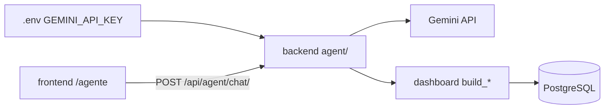
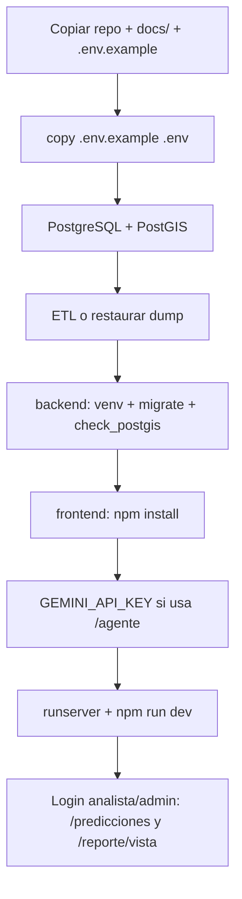

# Manual de instalación y ejecución desde cero

**Audiencia:** quien clona el repositorio desde GitHub sin base de datos ni entorno previo.  
**Última actualización:** 2026-06-22  
**Documentación del proyecto (`docs/`):** índice completo en `docs/README.md`. Archivos principales: este manual, `MANUAL_CARGA_DATOS_BD.md`, `DOCUMENTO_TECNICO_SISTEMA.md`, `LIBRERIAS_Y_SECCIONES.md`, `GUIA_SUSTENTACION_LIBRERIAS.md`, `GUIA_SUSTENTACION_COMPLETA.md`, `CIERRE_PROYECTO.md`, `esquema_base_datos.sql`. Evaluación de modelos: `evaluaciones/EVALUACION_MODULO_PREDICCIONES.md`.

---

## Tabla de contenidos

1. [Requisitos previos](#1-requisitos-previos)  
2. [Clonar el proyecto](#2-clonar-el-proyecto)  
3. [Variables de entorno](#3-variables-de-entorno)  
4. [Base de datos PostgreSQL](#4-base-de-datos-postgresql)  
5. [Backend Django](#5-backend-django)  
6. [Frontend React](#6-frontend-react)  
7. [Cargar datos Mede](#7-cargar-datos-mede)  
8. [Docker (opcional)](#8-docker-opcional)  
9. [Migraciones Django con BD creada por SQL](#9-migraciones-django-con-bd-creada-por-sql)  
10. [Pruebas automatizadas](#10-pruebas-automatizadas)  
11. [Problemas frecuentes](#11-problemas-frecuentes)  
12. [Checklist “listo para demo”](#12-checklist-listo-para-demo)  
13. [Inventario para ejecutar en otro computador](#13-inventario-para-ejecutar-en-otro-computador)

---

## 1. Requisitos previos

| Componente | Versión recomendada | Notas |
|------------|---------------------|--------|
| **Git** | Reciente | Clonar el repositorio |
| **Python** | 3.11 o 3.12 | Backend y scripts ETL en la raíz |
| **Node.js** | 18+ o 20 LTS | Frontend Vite |
| **PostgreSQL** | 14+ | Con extensión **PostGIS** habilitada |
| **OSGeo4W** | GDAL 3.x | Solo **Windows** con PostGIS local y GeoDjango |

**Opcional:** Docker Desktop (PostgreSQL y/o backend en contenedor).

**No incluye el repositorio público típico:** archivo `.env`, Excel Mede, carpeta `docs/` completa (puede estar en `.gitignore`), shapefiles en `docs/shp/`. Debe copiarlos desde el material del grado o generarlos con el ETL.

---

## 2. Clonar el proyecto

```powershell
git clone <URL-del-repositorio> SG_Mitigacion_Accidentes
cd SG_Mitigacion_Accidentes
```

### 2.1 Árbol del proyecto (referencia única)

```text
SG_Mitigacion_Accidentes/
├── .env.example                 # Plantilla de variables (copiar → .env)
├── .gitignore
├── README.md                    # Único .md versionado en Git público
├── docker-compose.yml           # Postgres + backend (opcional)
├── requirements-etl.txt         # Dependencias Python del ETL (raíz)
├── carga_mede_pgadmin.sql       # Carga idempotente Mede → PostgreSQL
├── mede_limpieza.py             # Reglas de depuración (fuente única ETL)
├── mede_eda_export.py           # EDA y figuras
├── mede_pipeline_guiado.py      # Pipeline por pasos
├── Mede_Victimas_inci.xlsx      # Excel fuente (local; gitignored)
├── salida/                      # CSV depurado, figuras EDA (gitignored)
│
├── scripts/
│   └── cargar_poligonos_medellin.py   # Wrapper → manage.py cargar_poligonos
│
├── docs/                        # Documentación local (gitignored en remoto)
│   ├── README.md
│   ├── DOCUMENTO_TECNICO_SISTEMA.md
│   ├── LIBRERIAS_Y_SECCIONES.md
│   ├── GUIA_SUSTENTACION_LIBRERIAS.md
│   ├── GUIA_SUSTENTACION_COMPLETA.md
│   ├── MANUAL_INSTALACION_EJECUCION.md
│   ├── MANUAL_CARGA_DATOS_BD.md
│   ├── CIERRE_PROYECTO.md
│   ├── esquema_base_datos.sql
│   └── shp/shp_barrios_y_veredas_mr/  # Shapefile límites
│
├── evaluaciones/                # Evaluación Predicciones (MD + CSV; gitignored si *.md)
│   └── EVALUACION_MODULO_PREDICCIONES.md
│
├── backend/
│   ├── manage.py
│   ├── pytest.ini               # settings_test + SQLite
│   ├── conftest.py              # Fixture analista_client para tests
│   ├── requirements.txt
│   ├── run_dev.ps1
│   ├── Dockerfile
│   ├── config/                  # settings, urls, wsgi, settings_test
│   ├── accounts/                # JWT, roles, registro, reset clave, admin API
│   │   ├── migrations/
│   │   ├── management/commands/sync_migration_history.py
│   │   └── tests/
│   ├── agent/                   # Asistente Gemini (/api/agent/)
│   │   ├── gemini.py, service.py, tools.py, views.py, cache.py
│   │   └── tests/
│   ├── reports/                 # Reportes imprimibles (/api/reportes/)
│   │   ├── tablero.py, mapa.py, predicciones.py, views.py
│   │   └── tests/
│   ├── dashboard/               # Indicadores tablero/mapa/predicciones
│   │   ├── views.py, urls.py (vía config)
│   │   ├── kpis.py, tops.py, hotspots.py, predicciones_mensuales.py
│   │   ├── modelos_arima.py     # ARIMA/SARIMA (statsmodels)
│   │   ├── map_cache.py, area_analisis.py, geo_topojson.py
│   │   ├── management/commands/
│   │   │   ├── check_postgis.py
│   │   │   ├── run_postgis_sql.py
│   │   │   ├── cargar_poligonos_medellin.py
│   │   │   └── actualizar_territorio_espacial.py
│   │   └── tests/               # test_*.py (27+ archivos)
│   └── sql/
│       ├── auth/001_password_reset_token.sql
│       └── postgis/001 … 006_*.sql
│
└── frontend/
    ├── package.json, vite.config.js, index.html
    ├── public/                  # favicon.svg, icons.svg
    └── src/
        ├── App.jsx, main.jsx, index.css
        ├── pages/               # Landing, Mapa, Dashboard, Agente, Predicciones, AdminUsuarios, ReportePreview, auth
        ├── components/          # Layout, RequireAnalista, RequireAdministrador, reportes/, ChartWheelZoom, …
        ├── map/                 # Caché mapa, área, choropleth, worker
        ├── api/                 # client.js, agentClient.js, reportClient.js
        ├── agent/               # agentHistoryCache.js
        ├── auth/, context/, hooks/, workers/
        └── assets/              # hero-medellin-trafico.png
```

**Nota:** `backend/ARBOL.md` y la wiki duplicada en `docs/sistemaMitigacion.wiki/` fueron retirados; este §2.1 es la referencia vigente (ver `CIERRE_PROYECTO.md` §6).

---

## 3. Variables de entorno

Desde la **raíz** del repositorio:

```powershell
copy .env.example .env
```

Editar `.env`:

| Variable | Obligatorio | Descripción |
|----------|-------------|-------------|
| `DJANGO_SECRET_KEY` | Sí | Cadena aleatoria larga (producción: única y secreta) |
| `DJANGO_DEBUG` | No | `1` en desarrollo |
| `DJANGO_ALLOWED_HOSTS` | Sí | `localhost,127.0.0.1` (+ `backend` si usa Docker) |
| `POSTGRES_DB` | Sí | Nombre de la base, ej. `mitigacion_accidentes` |
| `POSTGRES_USER` | Sí | Usuario Postgres |
| `POSTGRES_PASSWORD` | Sí | Contraseña |
| `POSTGRES_HOST` | Sí | `localhost` o `db` (Docker) |
| `POSTGRES_PORT` | Sí | `5432` o el puerto local (ej. `5434` en pgAdmin) |
| `DJANGO_USE_POSTGIS` | Sí | `1` |
| `CORS_ALLOWED_ORIGINS` | Sí | `http://localhost:5173,http://127.0.0.1:5173` |
| `CSRF_TRUSTED_ORIGINS` | Sí | Igual que CORS para desarrollo |
| `JWT_ACCESS_MINUTES` | No | Default `15` |
| `JWT_REFRESH_DAYS` | No | Default `7` |
| `FRONTEND_URL` | No | `http://localhost:5173` (enlaces de recuperación de clave) |
| `GDAL_LIBRARY_PATH` | Windows | Ej. `C:\OSGeo4W\bin\gdal313.dll` |
| `GEOS_LIBRARY_PATH` | Windows | Ej. `C:\OSGeo4W\bin\geos_c.dll` |
| `GEMINI_API_KEY` | Sí para `/agente` | Clave en [Google AI Studio](https://aistudio.google.com/apikey) |
| `AGENT_MODEL_FLASH` | No | Default `gemini-2.5-flash` |
| `AGENT_MODEL_FLASH_LITE` | No | Default `gemini-2.5-flash-lite` |
| `AGENT_CACHE_TTL` | No | Segundos de caché de respuestas (default `86400`) |
| `AGENT_DAILY_LIMIT_PER_IP` | No | Límite diario por IP (default `40`; `0` = sin límite propio) |

**Importante:** `manage.py` fuerza siempre `DJANGO_SETTINGS_MODULE=config.settings` (PostgreSQL). No use `config.settings_test` para `runserver`.

### 3.1 Asistente IA (opcional pero recomendado para demo)

Sin `GEMINI_API_KEY`, la ruta `/agente` carga la UI pero el chat responde error 503. Para habilitarlo:

```env
GEMINI_API_KEY=su_clave_de_aistudio
AGENT_MODEL_FLASH=gemini-2.5-flash
AGENT_MODEL_FLASH_LITE=gemini-2.5-flash-lite
AGENT_CACHE_TTL=86400
AGENT_DAILY_LIMIT_PER_IP=40
```

Reinicie el backend tras editar `.env`. El frontend no necesita variables adicionales (proxy Vite hacia `/api`).



---

## 4. Base de datos PostgreSQL

### 4.1 Opción A — PostgreSQL instalado en el PC (recomendado para desarrollo)

1. Instalar PostgreSQL con PostGIS (Stack Builder o paquete que incluya la extensión).
2. En pgAdmin, crear una base vacía, por ejemplo `mitigacion_accidentes`.
3. Seguir **`MANUAL_CARGA_DATOS_BD.md`**: esquema, scripts PostGIS `001`–`006`, ETL Mede, polígonos.

### 4.2 Opción B — Solo la base en Docker

Desde la raíz:

```powershell
docker compose up db -d
```

En `.env` para el host (no dentro del contenedor backend):

```env
POSTGRES_HOST=localhost
POSTGRES_PORT=5432
POSTGRES_DB=mitigacion_accidentes
```

El volumen `pgdata` guarda los datos del contenedor. **No** comparte datos con una instancia Postgres en otro puerto (ej. `5434`).

### 4.3 Windows + GeoDjango

Si al ejecutar `manage.py` aparece error al importar GDAL:

1. Instalar [OSGeo4W](https://trac.osgeo.org/osgeo4w/) (paquete GDAL).
2. Descomentar y ajustar en `.env` las rutas a `gdal*.dll` y `geos_c.dll` (la versión del número en el nombre del DLL debe coincidir con la instalada).
3. Reiniciar la terminal tras instalar OSGeo4W.

---

## 5. Backend Django

```powershell
cd backend
python -m venv .venv
.\.venv\Scripts\activate
pip install -r requirements.txt
```

Incluye **statsmodels** (≥0.14) para modelos **ARIMA/SARIMA** en `/predicciones` y reportes de predicciones. Si actualizó el repo y ya tenía un venv antiguo:

```powershell
pip install "statsmodels>=0.14"
```

**Comprobación rápida:**

```powershell
python -c "import statsmodels; print('statsmodels OK', statsmodels.__version__)"
```

### 5.1 Verificar PostGIS

```powershell
python manage.py check_postgis
```

Debe reportar conexión OK y extensión PostGIS disponible.

### 5.2 Migraciones

**Si la base está vacía y solo usará migraciones Django** (sin dominio Mede aún):

```powershell
python manage.py migrate
```

**Si ejecutó antes `docs/esquema_base_datos.sql`** (recomendado para el grado): ver [sección 9](#9-migraciones-django-con-bd-creada-por-sql).

### 5.3 Arrancar el servidor de desarrollo

```powershell
.\run_dev.ps1
```

O:

```powershell
python manage.py runserver 127.0.0.1:8000
```

**Comprobación:** abrir en el navegador o con `curl`:

`http://127.0.0.1:8000/api/dashboard/kpis/`

Respuesta JSON (puede mostrar ceros sin datos cargados).

### 5.4 Usuarios de demostración

Tras `python manage.py migrate` (incluye `accounts.0002_seed_roles` y `0005_seed_admin_user`):

| Rol | Usuario | Contraseña | Uso |
|-----|---------|------------|-----|
| **Administrador** | `admin` | `AdminUSB2026!` | Predicciones, reportes y `/admin/usuarios` |

**Analista adicional:** registrarse en `/registro` con rol **analista**, o:

```powershell
python manage.py createsuperuser
```

(asignar rol analista en `/admin/usuarios` si usa cuenta superusuario sin perfil).

---

## 6. Frontend React

Nueva terminal:

```powershell
cd frontend
npm install
npm run dev
```

Abrir: **http://localhost:5173**

Vite redirige las peticiones `/api/*` al backend en `http://127.0.0.1:8000` (ver `vite.config.js`).

| Ruta | Descripción |
|------|-------------|
| `/` | Landing / inicio (público) |
| `/mapa` | Mapa de incidentes (público) |
| `/tablero` | KPIs y gráficos (público) |
| `/agente` | Asistente IA — chat Gemini (público; predicciones en chat con JWT analista o admin) |
| `/predicciones` | Proyecciones y modelos (analista o administrador) |
| `/reporte/vista` | Vista previa de reportes imprimibles (analista o administrador) |
| `/admin/usuarios` | Gestión de usuarios (solo **administrador**) |
| `/login`, `/registro`, `/recuperar-clave` | Autenticación |

**Reportes:** en tablero, mapa o predicciones use *Generar reporte* → modal → **`/reporte/vista`** → impresión/PDF del navegador. APIs: `POST /api/reportes/tablero/`, `/mapa/`, `/predicciones/`.

**Predicciones:** modelos `ols`, `estacional`, `poisson`, `media_movil`, `tres_sigma` (μ±3σ), `arima`, `sarima` (statsmodels). Guía de métricas y hold-out en la propia pantalla.

---

## 7. Cargar datos Mede

Sin filas en `incidente` y `victima`, el mapa y el tablero muestran ceros.

1. Obtener `Mede_Victimas_inci.xlsx` (datos abiertos Medellín).
2. Seguir **`MANUAL_CARGA_DATOS_BD.md`** de principio a fin.
3. Verificar conteos con `postgis_f2_status` o SQL `SELECT COUNT(*) FROM incidente`.

---

## 8. Docker (opcional)

El archivo `docker-compose.yml` define dos servicios:

| Servicio | Imagen / build | Puerto | Función |
|----------|----------------|--------|---------|
| `db` | `postgis/postgis:16-3.4` | 5432 | PostgreSQL + PostGIS, volumen `pgdata` |
| `backend` | `backend/Dockerfile` | 8000 | `migrate` + `runserver 0.0.0.0:8000` |

### 8.1 Levantar todo

Desde la raíz (con `.env` configurado):

```powershell
docker compose up --build
```

El backend sobrescribe `POSTGRES_HOST=db` y `POSTGRES_PORT=5432` dentro del contenedor.

### 8.2 Implicaciones

- **No** ejecute además `python manage.py runserver` en el puerto 8000 del host (conflicto de puerto).
- El frontend **sigue en el host:** `cd frontend && npm run dev`.
- Los datos Mede **no** se cargan solos: ejecute el ETL y `carga_mede_pgadmin.sql` contra la base del contenedor (host `localhost`, puerto `5432` mapeado).
- Cada máquina o volumen nuevo requiere **volver a cargar** Mede si necesita demo con datos.

### 8.3 Solo base de datos en Docker

```powershell
docker compose up db -d
```

Use el backend local apuntando `POSTGRES_HOST=localhost`, `POSTGRES_PORT=5432`.

---

## 9. Migraciones Django con BD creada por SQL

Escenario habitual del proyecto: la base se creó con **`docs/esquema_base_datos.sql`**, que ya incluye tablas `auth_*`, `django_*`, `rol`, etc., pero el historial en `django_migrations` puede estar incompleto o desalineado.

### 9.1 Síntomas

| Error / síntoma | Causa |
|-----------------|--------|
| `column django_content_type.name does not exist` | Esquema SQL sin columna `name` pero Django espera migración `0002_remove_content_type_name` aplicada |
| `relation "auth_user" already exists` al `migrate` | Tablas ya creadas por SQL; Django intenta crearlas de nuevo |
| `unrecognized token: ":"` en APIs del tablero | Backend usando **SQLite** (settings de prueba) por proceso equivocado en puerto 8000 |
| Mapa/tablero vacíos con BD “bien” | Datos no cargados o PostGIS sin geometrías |

### 9.2 Procedimiento recomendado

Con el venv activado en `backend/`:

```powershell
python manage.py sync_migration_history
python manage.py migrate
python manage.py showmigrations accounts
```

`sync_migration_history` **registra** en `django_migrations` las migraciones core y de `accounts` **sin ejecutar SQL** (comando en `accounts/management/commands/sync_migration_history.py`).

Resultado esperado de `migrate`: **No migrations to apply.**

`showmigrations accounts` debe mostrar `[X]` en:

- `0001_initial`
- `0002_seed_roles`
- `0003_password_reset_token`
- `0004_alter_perfilusuario_telefono`

### 9.3 Si `migrate` sigue fallando

- **`DuplicateTable`:** tablas ya existen → `python manage.py migrate --fake-initial` (solo si comprende que no recreará tablas).
- **Conflicto puntual:** revisar qué migración falla y si el esquema SQL ya cubre ese cambio; en el peor caso, alinear manualmente `django_migrations` con el estado real (último recurso en desarrollo).

### 9.4 Evitar SQLite en desarrollo

1. Cerrar todos los procesos en el puerto 8000:

```powershell
Get-NetTCPConnection -LocalPort 8000 -ErrorAction SilentlyContinue | Select-Object OwningProcess
Stop-Process -Id <PID> -Force
```

2. Un solo `runserver` desde `backend/` con venv activado.
3. No exportar `DJANGO_SETTINGS_MODULE=config.settings_test` en la terminal de desarrollo.

---

## 10. Pruebas automatizadas

```powershell
cd backend
.\.venv\Scripts\activate
pytest
```

**Esperado:** suite en verde (`python -m pytest -q`). Configuración en `backend/pytest.ini` → `config.settings_test`, SQLite en memoria. Incluye tests de `dashboard/`, `agent/` y `reports/`.

Requisitos: ejecutar desde `backend/` con venv activado y dependencias instaladas (`pip install -r requirements.txt`, incluye **statsmodels**). Use `python -m pytest -q` (no solo `pytest` si el comando no está en PATH).

Los tests de endpoints de **predicciones** y **reportes** autentican con rol analista vía `backend/conftest.py`. Eso **no** sustituye `python manage.py check_postgis` en PostgreSQL real.

Pruebas focalizadas:

```powershell
python -m pytest agent/tests/test_agent_api.py -q
python -m pytest reports/tests/ -q
python -m pytest dashboard/tests/test_modelos_arima.py -q
```

---

## 11. Problemas frecuentes

| Síntoma | Causa probable | Solución |
|---------|----------------|----------|
| `ImproperlyConfigured: Could not find the GDAL library` | OSGeo4W no instalado o rutas mal en `.env` | Instalar OSGeo4W; `GDAL_LIBRARY_PATH` / `GEOS_LIBRARY_PATH` |
| Error de conexión Postgres | Host/puerto/contraseña | Revisar `.env`; probar conexión en pgAdmin |
| APIs 503 / error BD | Postgres caído o BD inexistente | Levantar servicio; crear base |
| `unrecognized token: ":"` | SQLite activo | Cerrar procesos 8000; un solo runserver con `config.settings` |
| `DuplicateTable` en migrate | SQL + migrate sin sync | `sync_migration_history` luego `migrate` |
| Mapa sin puntos | Sin ETL o sin script `002` ubicacion | `MANUAL_CARGA_DATOS_BD.md` |
| Predicciones 401/403 | Sin token o rol ciudadano | Login con **analista** o **admin** |
| ARIMA/SARIMA sin ajuste o error import | Falta `statsmodels` en venv | `pip install -r requirements.txt` o `pip install "statsmodels>=0.14"`; reiniciar `runserver` |
| Reportes 404 | Backend antiguo sin `reports/` | Reiniciar servidor tras actualizar código; verificar `config/urls.py` incluye `reports` |
| Asistente 503 `gemini_error` | Sin `GEMINI_API_KEY` o cuota agotada | Definir clave en `.env`; esperar reset o usar caché |
| Asistente rechaza predicciones | Sin sesión analista | Login; el chat envía JWT automáticamente |
| Asistente 429 `daily_limit` | Límite `AGENT_DAILY_LIMIT_PER_IP` | Esperar al día siguiente o reformular pregunta cacheada |
| CORS en navegador | Origen no listado | Añadir URL de Vite a `CORS_ALLOWED_ORIGINS` |
| Puerto 8000 ocupado | Docker + runserver local | Detener uno de los dos |
| Docker sin datos | Volumen vacío | Cargar Mede en esa instancia |

---

## 12. Checklist “listo para demo”

- [ ] `.env` en la raíz con Postgres y PostGIS
- [ ] `python manage.py check_postgis` → OK
- [ ] `sync_migration_history` + `migrate` sin errores (si usó SQL manual)
- [ ] Mede cargado: `COUNT(*)` en `incidente` > 0
- [ ] Scripts PostGIS `001`–`006` ejecutados; polígonos y `actualizar_territorio_espacial` si usa modo espacial
- [ ] `runserver` en 8000 y `npm run dev` en 5173
- [ ] `/` muestra puntos; `/tablero` KPIs coherentes
- [ ] Usuario **admin** (`AdminUSB2026!`) o analista de prueba; `/predicciones` accesible tras login
- [ ] `pip install -r requirements.txt` incluye **statsmodels**; modelos ARIMA/SARIMA y μ±3σ disponibles
- [ ] *Generar reporte* abre **`/reporte/vista`** (analista o admin)
- [ ] `GEMINI_API_KEY` en `.env`; `/agente` responde una pregunta histórica
- [ ] Con login analista/admin, `/agente` responde una pregunta de proyección
- [ ] (Opcional) `/admin/usuarios` con rol administrador
- [ ] (Sustentación) Repasar `GUIA_SUSTENTACION_COMPLETA.md` y `evaluaciones/EVALUACION_MODULO_PREDICCIONES.md`

---

## 13. Inventario para ejecutar en otro computador

Use esta lista al copiar el proyecto por **USB**, **Git** o **zip**. Los datos Mede y `docs/` suelen estar **gitignored** en el remoto público; en una máquina nueva deben copiarse explícitamente.

### 13.1 Imprescindibles (código + configuración)

| Elemento | Ruta | Notas |
|----------|------|-------|
| Código backend | `backend/` | Incluye `agent/`, `dashboard/`, `reports/`, `accounts/`, `sql/postgis/` |
| Código frontend | `frontend/` | `package.json` + `package-lock.json` |
| Variables plantilla | `.env.example` | Copiar a `.env` y editar |
| ETL | `mede_limpieza.py`, `mede_pipeline_guiado.py`, `mede_eda_export.py` | Raíz del repo |
| Carga SQL | `carga_mede_pgadmin.sql` | Raíz |
| Dependencias ETL | `requirements-etl.txt` | `pip install -r` en venv de análisis |
| Docker (opcional) | `docker-compose.yml`, `backend/Dockerfile` | Solo si usa contenedores |
| Script polígonos | `scripts/cargar_poligonos_medellin.py` | Wrapper opcional |

### 13.2 Documentación local (`docs/`)

| Archivo | Rol |
|---------|-----|
| `DOCUMENTO_TECNICO_SISTEMA.md` | Arquitectura, APIs, modelos, agente IA |
| `LIBRERIAS_Y_SECCIONES.md` | Librerías por pantalla y modelo |
| `GUIA_SUSTENTACION_LIBRERIAS.md` | FAQ corto sustentación |
| `GUIA_SUSTENTACION_COMPLETA.md` | Demo y FAQ jurado |
| `MANUAL_INSTALACION_EJECUCION.md` | Este manual |
| `MANUAL_CARGA_DATOS_BD.md` | ETL, PostGIS, polígonos |
| `CIERRE_PROYECTO.md` | Alcance final y checklist de cierre |
| `evaluaciones/EVALUACION_MODULO_PREDICCIONES.md` | Evaluación cerrada Predicciones §1–§5 |
| `esquema_base_datos.sql` | DDL de referencia |
| `shp/shp_barrios_y_veredas_mr/` | Shapefile límites (no suele ir a Git público) |

### 13.3 Datos (no van en Git público típico)

| Elemento | Ruta típica | ¿Regenerable? |
|----------|-------------|---------------|
| Excel Mede fuente | `Mede_Victimas_inci.xlsx` (raíz) | No — copiar del equipo USB / MedeDatos |
| CSV depurado | `salida/Mede_Victimas_inci_depurado.csv` | Sí — con ETL (~30 min) |
| Base PostgreSQL | Instancia local o dump | Sí — con ETL + carga SQL |
| Secreto Gemini | `.env` → `GEMINI_API_KEY` | Obtener en AI Studio |

**Puede eliminar en el PC origen (regenerable):** `frontend/dist/`, `frontend/node_modules/`, `backend/.venv/`, `__pycache__/`, `backend/.pytest_cache/`, `pgdata/` (Docker), duplicados como `Mede_Victimas_inci (1).csv` si conserva el `.xlsx`.

### 13.4 Orden mínimo en máquina nueva



Detalle de cada paso: secciones [3](#3-variables-de-entorno)–[7](#7-cargar-datos-mede) de este manual y `MANUAL_CARGA_DATOS_BD.md`.

---

*Fin del manual de instalación y ejecución.*
