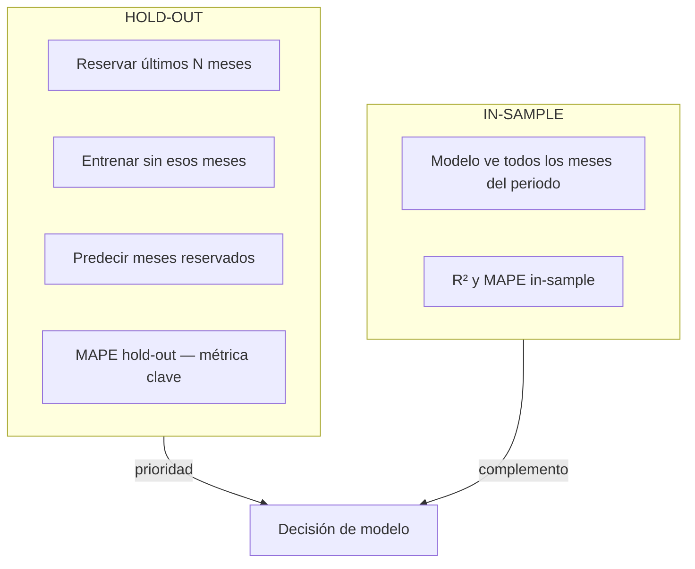
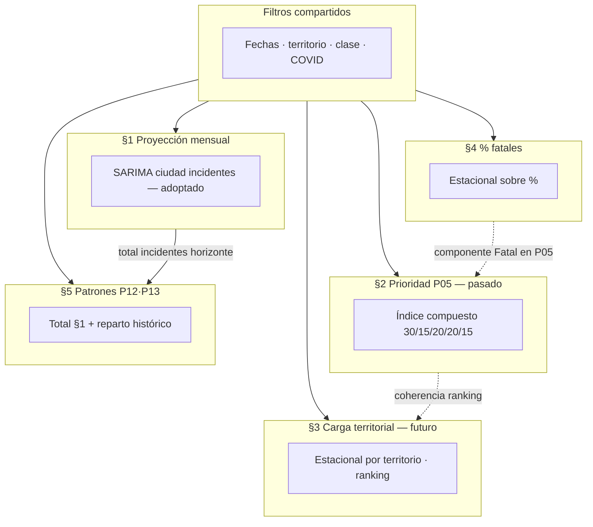
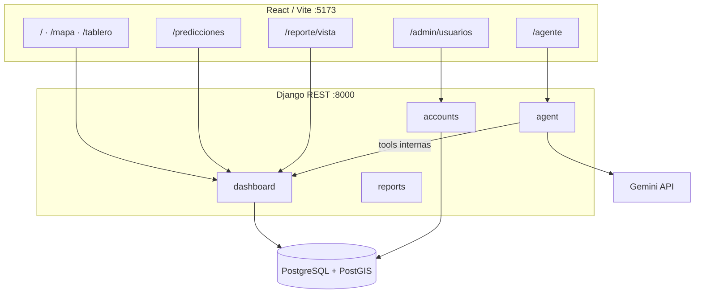

# ViaData — Medellín  
## Documentación integral para tesis de grado

**Institución:** Universidad San Buenaventura (USB)  
**Proyecto:** Sistema de información para mitigación de accidentes de tránsito  
**Caso de estudio:** Medellín — datos abiertos Mede (~2014–2021)  
**Versión:** 1.0 — unificación documental (2026-06-22)  

---

## Cómo usar este documento

Este archivo consolida toda la documentación técnica, metodológica y de evaluación del proyecto **ViaData**. Está pensado para **exportar bloques** al documento de tesis que ya tienes en otro archivo.

| Marcador | Significado |
|----------|-------------|
| `<!-- TESIS: ... -->` | Sugerencia de capítulo o sección en la tesis |
| `<!-- COPIAR -->` | Bloque listo para pegar con mínima edición |
| Tablas y diagramas mermaid | Incluir en Word/LaTeX como figuras numeradas |

**Fuentes integradas:** `EVALUACION_MODULO_PREDICCIONES.md`, `GUIA_SUSTENTACION_COMPLETA.md`, `DOCUMENTO_TECNICO_SISTEMA.md`, `LIBRERIAS_Y_SECCIONES.md`, `MANUAL_CARGA_DATOS_BD.md`, `MANUAL_INSTALACION_EJECUCION.md`, `CIERRE_PROYECTO.md`, CSV en `evaluaciones/`.

**Registros numéricos:** los CSV de `evaluaciones/` son la evidencia tabular; en la tesis cite los archivos como anexo o transcriba las tablas clave de la sección 6.

---

## Tabla de contenidos

1. [Introducción y alcance](#1-introducción-y-alcance)
2. [Marco teórico](#2-marco-teórico)
3. [Marco conceptual](#3-marco-conceptual)
4. [Metodología](#4-metodología)
5. [Diseño e implementación del sistema](#5-diseño-e-implementación-del-sistema)
6. [Resultados de la evaluación](#6-resultados-de-la-evaluación)
7. [Discusión y limitaciones](#7-discusión-y-limitaciones)
8. [Conclusiones](#8-conclusiones)
9. [Referencias bibliográficas](#9-referencias-bibliográficas)
10. [Anexos](#10-anexos)

---

<!-- TESIS: Introducción -->

## 1. Introducción y alcance

### 1.1 Problema y propuesta

La siniestralidad vial en Medellín se documenta en registros administrativos (Mede) con alta granularidad temporal, territorial y por tipo de evento. Sin embargo, la consulta y el análisis exigen herramientas que integren **visualización geoespacial**, **indicadores descriptivos**, **proyecciones orientativas** y **consulta en lenguaje natural**, con trazabilidad de los cálculos.

**ViaData — Medellín** es un sistema web que:

- Expone mapa y tablero descriptivo de forma **pública**.
- Ofrece proyecciones mensuales, priorización territorial y patrones temporales a **analistas autenticados**.
- Incorpora un **asistente conversacional** (Google Gemini) que invoca las mismas APIs del backend — no inventa cifras.
- Permite a un **administrador** gestionar usuarios y roles.

<!-- COPIAR -->

> El sistema organiza la accidentalidad a partir de datos abiertos Mede; las proyecciones son **modelos estadísticos transparentes** (OLS, estacional, Poisson, media móvil, μ±3σ, ARIMA/SARIMA) con validación **hold-out**. **No se afirma causalidad** ni probabilidad individual de sufrir un accidente.

### 1.2 Objetivos cumplidos

| Objetivo del grado | Cumplimiento en ViaData |
|--------------------|-------------------------|
| Arquitectura geoespacial | PostgreSQL + PostGIS; modo registro vs espacial; G03 |
| Análisis temporal, territorial y por gravedad | Tablero `/tablero` + mapa `/mapa` |
| Tablero de monitoreo | KPIs, series, matrices día×hora, rankings |
| Componente predictivo | `/predicciones` — bloques §1–§5 evaluados y cerrados |
| Consulta en lenguaje natural | `/agente` — Gemini + function calling |
| Gestión de usuarios | `/admin/usuarios` — rol administrador |
| Validación técnica | `pytest` (dashboard, agent, accounts, reports); ETL reproducible |

### 1.3 Alcance omitido (decisión de cronograma)

| Tema | Motivo |
|------|--------|
| P11 ranking por vía / punto crítico | Mede no alimenta catálogos `via` / `punto_critico` |
| G04 buffer punto crítico | Tabla `punto_critico` vacía |
| P15 / ML espacial avanzado | Fuera de alcance v1; modelos parsimoniosos |
| Ingesta automática diaria | ETL manual documentado |
| PDF en servidor | Impresión nativa del navegador (`window.print`) |
| scikit-learn / redes neuronales | No acordado; modelos interpretables |

---

<!-- TESIS: Marco teórico -->

## 2. Marco teórico

### 2.1 Accidentología y análisis de conteos

Los accidentes de tránsito son eventos de **conteo** agregados en el tiempo y el espacio. En la literatura de seguridad vial, las series de siniestros se modelan con:

- **Regresión de Poisson** y **binomial negativa** cuando hay sobredispersión respecto a la varianza esperada bajo Poisson pura.
- **Modelos de series temporales** (ARIMA, SARIMA) cuando importa la **memoria temporal** y la **estacionalidad** intra-anual.
- **Regresión lineal simple (OLS)** como línea base interpretable, aunque suele ignorar estacionalidad y naturaleza de conteo.

**Referencias clave:** Lord & Mannering (2010); Washington, Karlaftis & Mannering (2020).

En este proyecto se implementan variantes **didácticas y comparables en la interfaz**, priorizando **interpretabilidad** y **validación predictiva** (hold-out) sobre complejidad de machine learning.

### 2.2 Series temporales y validación predictiva

Una serie mensual de incidentes combina:

- **Tendencia** (cambio gradual del nivel medio).
- **Estacionalidad** (patrones por mes calendario).
- **Shocks** (p. ej. confinamiento COVID mar–ago 2020).

**In-sample vs hold-out:**

| Enfoque | Qué mide | Uso en ViaData |
|---------|----------|----------------|
| **In-sample** | Ajuste a todo el periodo (R², MAPE in-sample) | Descripción; riesgo de sobreajuste |
| **Hold-out** | Reservar últimos *N* meses, entrenar sin ellos, predecirlos | **Criterio principal** para elegir modelo |

**Criterio adoptado:** MAPE hold-out ≤ 20 % → precisión estimada ≈ 100 % − MAPE (umbral exploratorio del 80 %). No se exige R² ≥ 0,80 en series mensuales con COVID (poco realista).



### 2.3 Indicadores espaciales y calidad de datos

- **Densidad** (incidentes/km²): normaliza volumen por extensión territorial.
- **ST_Contains** (PostGIS): asigna comuna/barrio oficial a partir de coordenadas.
- **Indicador G03:** porcentaje de coincidencia entre territorio declarado en el registro y territorio espacial — mide calidad cartográfica del dato.

**Referencia SIG:** Obe & Hsu (2015) — PostGIS en análisis espacial.

### 2.4 Proporciones y gravedad relativa

El **porcentaje de víctimas fatales** (fatales ÷ víctimas × 100) es una serie de **proporción mensual**, más volátil que los conteos. Modelos adecuados incluyen regresión sobre el % con estacionalidad, **logit con exposición** (meses con más víctimas pesan más) y **ratio compuesto** (proyectar fatales y víctimas por separado y dividir).

### 2.5 Inteligencia artificial generativa en sistemas de información

Los **LLM** (p. ej. Google Gemini) pueden orquestar consultas en lenguaje natural, pero **no deben sustituir** el motor de cálculo. En ViaData el asistente usa **function calling**: el modelo elige herramientas que llaman al mismo código Python/SQL que el tablero — evitando text-to-SQL libre y alucinación numérica.

---

<!-- TESIS: Marco conceptual -->

## 3. Marco conceptual

### 3.1 Definiciones operativas

| Término | Definición en ViaData |
|---------|----------------------|
| **Incidente** | Evento de siniestro vial registrado en Mede (conteo distinto por `incidente.id`) |
| **Víctima** | Persona asociada a un incidente (`victima.id`) |
| **Víctima fatal** | Según catálogo `gravedad_victima` (fatal, muerte, etc.) |
| **Participación día semana** | % de incidentes en un día respecto al total del periodo — **no** probabilidad individual |
| **Proyección** | Escenario orientativo bajo estabilidad del patrón histórico filtrado |
| **Hold-out** | Validación con meses reservados al final del rango |
| **Modo registro / espacial** | Filtro por comuna/barrio del Excel vs polígono PostGIS |

### 3.2 Taxonomía de indicadores del sistema

#### Indicadores geoespaciales y de calidad (G)

| ID | Nombre | Idea |
|----|--------|------|
| G01–G02 | Densidad territorial | Incidentes / km² |
| G03 | Calidad territorio | % coincidencia registro vs espacial |
| G06 | Top celdas | Ranking de concentración espacial |
| F3 | Modo territorio | Parámetro `registro` \| `espacial` en APIs |

#### Indicadores predictivos y de priorización (P)

| ID | Bloque UI | Pregunta |
|----|-----------|----------|
| P01–P04 | §1 Proyección mensual | ¿Cuántos incidentes/víctimas/fatales por mes? |
| P05 | §2 Prioridad territorial | ¿Qué territorio priorizar **hoy**? |
| P07 | §4 Proporción fatales | ¿Cómo evoluciona el % de fatales? |
| P08–P10 | §3 Carga territorial | ¿Qué territorio concentrará **carga futura**? |
| P12 | §5 Matriz día×hora | ¿Cuándo se concentrarían los incidentes? |
| P13 | §5 Día semana | Resumen de P12 por día |
| P14 | Mapa | Hotspots servidor (cuadrícula) |

### 3.3 Roles y permisos

| Rol | Tablero / Mapa / Agente | Predicciones / Reportes | Admin usuarios |
|-----|-------------------------|-------------------------|----------------|
| Sin login | Sí | No | No |
| Ciudadano | Sí | No | No |
| Analista | Sí | Sí | No |
| Administrador | Sí | Sí | Sí |
| Autoridad | Sí (reservado) | No | No |

### 3.4 Cadena conceptual volumen → territorio → temporalidad



**Integración clave:** §5 **no** comparte modelo con §3. El total temporal proviene solo de §1 (siempre **incidentes** para el reparto P12/P13).

---

<!-- TESIS: Metodología -->

## 4. Metodología

### 4.1 Fuentes de datos y ETL

```text
Mede_Victimas_inci.xlsx
        │
        ▼
  mede_limpieza.depurar_mede()     ← reglas únicas (fuente de verdad)
        │
        ▼
  salida/Mede_Victimas_inci_depurado.csv
        │
        ▼
  carga_mede_pgadmin.sql → PostgreSQL
        │
        ▼
  backend/sql/postgis/001…006 + polígonos
        │
        ▼
  Aplicación Django (consultas SQL / GeoDjango)
```

- **Periodo típico en BD:** 2014-01-01 — 2021-09-30.
- **Volumen de referencia:** ~160 000+ incidentes con coordenadas válidas (según Excel y flags).
- **Principio:** toda regla de limpieza en `mede_limpieza.py`; EDA y pipeline importan la misma lógica.

### 4.2 Configuración estándar de evaluación (Predicciones)

| Parámetro | Valor |
|-----------|-------|
| Periodo referencia escenario A | 2018-01-01 — 2021-09-30 |
| Excluir mar–ago 2020 del ajuste | **Sí** (default UI) |
| Hold-out | 3 meses (6 opcional en §1 y §4) |
| Horizonte proyección | 3 meses |
| Escenarios §1 | A–I (ciudad, variable, territorio, clase, COVID, rangos cortos) |

### 4.3 Protocolo de evaluación por bloque

| Bloque | ¿Modelos comparados? | Métrica principal | Decisión |
|--------|---------------------|-------------------|----------|
| §1 | 7 modelos × 9 escenarios | MAPE hold-out | SARIMA ciudad incidentes |
| §2 | No (índice fijo) | Spearman índice↔frecuencia | P05 comunas referencia |
| §3 | 6 modelos en A; estacional en B–G | Spearman carga↔volumen | Estacional territorial |
| §4 | 8 modelos en A | MAPE hold-out sobre % | Estacional sobre % |
| §5 | Hereda §1 | Spearman patrón obs↔proy | Patrón estable; hereda §1 |

**Reproducibilidad:** scripts `backend/scripts/llenar_evaluacion_seccion*.py` y CSV en `evaluaciones/`.

### 4.4 Arquitectura de software



---

<!-- TESIS: Diseño / Implementación (si aplica) -->

## 5. Diseño e implementación del sistema

### 5.1 Stack tecnológico

| Capa | Tecnología | Justificación |
|------|------------|---------------|
| Backend | Django 5 + DRF + SimpleJWT | API JSON, auth, migraciones |
| BD | PostgreSQL + PostGIS | Consultas espaciales estándar |
| Cálculo API | NumPy + statsmodels (ARIMA/SARIMA) | Modelos transparentes |
| ETL offline | pandas (`requirements-etl.txt`) | Reproducibilidad Mede |
| Frontend | React 19 + Vite + React Router | SPA modular |
| Mapa | Leaflet + react-leaflet + plugins | OSM, heatmap, clusters |
| Gráficos | Recharts + react-zoom-pan-pinch | Series y zoom visual |
| Reportes | html2canvas + CSS `@media print` | PDF vía navegador |
| IA | Gemini API (urllib, function calling) | Diálogo en español |

### 5.2 Módulos backend

| App | Responsabilidad |
|-----|-----------------|
| `accounts` | JWT, roles, registro, admin usuarios |
| `dashboard` | KPIs, mapa, predicciones, prioridad, carga, patrones |
| `agent` | Chat Gemini + herramientas sobre `dashboard/*` |
| `reports` | Payload JSON para reportes imprimibles |

### 5.3 Modelos implementados (§1)

| Modelo | Implementación | Librería |
|--------|----------------|----------|
| OLS | `estadistica_series.py` | NumPy |
| Estacional / Poisson | idem | NumPy (WLS / diseño dummy) |
| Media móvil | `predicciones_mensuales.py` | Python |
| μ±3σ | idem | NumPy `mean`/`std` |
| ARIMA / SARIMA | `modelos_arima.py` | **statsmodels** |

### 5.4 Fórmulas de indicadores descriptivos

**KPIs tablero:**

- Total incidentes: \(\text{COUNT(DISTINCT incidente.id)}\)
- Variación % vs año anterior: \(\dfrac{Y_{actual} - Y_{anterior}}{Y_{anterior}} \times 100\)

**Densidad G01–G02:**

\[
\text{densidad} = \frac{\text{número de incidentes}}{\text{área (km}^2\text{)}}
\]

**Calidad G03:**

\[
\text{G03} = 100 \times \frac{\#\{\text{comuna registro} = \text{comuna espacial}\}}{\text{total incidentes}}
\]

### 5.5 Fórmulas de modelos predictivos

**OLS (P01):** \(Y_t = a + b \cdot t\)

**Estacional (P02):** \(Y_t = \beta_0 + \beta_1 t + \sum_{m=2}^{12} \gamma_m \mathbf{1}_{\text{mes}=m}\)

**Poisson log-lineal (P04):** \(\mathbb{E}[Y_t] = \exp(\beta_0 + \beta_1 t + \cdots)\)

**Media móvil:** \(\hat{Y} = \frac{1}{w}\sum_{i=0}^{w-1} Y_{n-i}\)

**μ±3σ:** \(\hat{Y} = \mu\); bandas \(\mu \pm 3\sigma\)

**SARIMA adoptado:** (2,1,3)(1,1,1,12) — `statsmodels`

**Índice P05:**

\[
\text{Índice} = 0{,}30\,s_{freq} + 0{,}15\,s_{dens} + 0{,}20\,s_{tend} + 0{,}20\,s_{fatal} + 0{,}15\,s_{part}
\]

Tendencia \(s_{tend}\): **delta de promedios mensuales** (no OLS del gráfico §1).

**Patrones §5 (dos pasos):**

1. Total horizonte = suma proyección mensual §1 (incidentes).
2. Reparto: \(\hat{n}_{d,h} = \text{total}_{proj} \times p_{d,h}\) con pesos históricos + Laplace (+0,5 celda P12; +0,25 día P13).

---

<!-- TESIS: Resultados -->

## 6. Resultados de la evaluación

**Estado global módulo Predicciones:** CERRADO (2026-06-18).  
**Evidencia:** CSV en `evaluaciones/` (revisión numérica 2026-06-19).

### 6.1 Resumen ejecutivo de decisiones

| Bloque | Pregunta | Decisión adoptada |
|--------|----------|-------------------|
| §1 | ¿Cuántos incidentes al mes? | **SARIMA(2,1,3)(1,1,1,12)** ciudad; alt. media móvil 3 m |
| §2 | ¿Qué territorio priorizar hoy? | Índice P05 fijo 30/15/20/20/15 |
| §3 | ¿Qué territorio concentrará carga? | Estacional por territorio; **ranking** > cifras exactas |
| §4 | ¿Evolución % fatales? | Estacional sobre %; alt. logit_offset, ratio_compuesto |
| §5 | ¿Cuándo ocurren? | Hereda §1 + patrón histórico; líder **martes 07:00** / **martes** |

### 6.2 §1 — Proyección mensual (escenario A, hold-out 3 meses)

| Modelo | MAPE in-sample | MAPE hold-out | Precisión est. | ¿Cumple 80 %? |
|--------|----------------|---------------|----------------|---------------|
| **SARIMA** | 13,1 % | **12,6 %** | ~87 % | Sí |
| Media móvil | 6,5 % | 15,7 % | ~84 % | Sí |
| ARIMA | 11,0 % | 19,9 % | ~80 % | Límite |
| OLS | 11,2 % | 18,9 % | ~81 % | Sí |
| Poisson | 8,3 % | 22,5 % | ~78 % | No |
| Estacional | 8,4 % | 22,4 % | ~78 % | No |

**Hallazgo:** Poisson y estacional ganan in-sample pero pierden en hold-out.

**Mejor hold-out por escenario (selección):**

| ID | Contexto | Mejor modelo | MAPE prueba |
|----|----------|--------------|-------------|
| A | Incidentes ciudad | SARIMA | 12,6 % |
| B | Víctimas ciudad | Media móvil | 14,7 % |
| C | Fatales ciudad | Estacional | 19,7 % |
| D | Castilla | Media móvil | 8,4 % |
| E | Atropello | Poisson | 11,6 % |
| F | Sin excl. COVID | OLS 11,7 %; **SARIMA 32,9 %** | Confirma excluir COVID |

*Fuente completa:* `predicciones_seccion1_proyeccion_mensual.csv` (63 filas).

### 6.3 §2 — Prioridad territorial P05

| ID | Top 1 | Spearman | ranking_util |
|----|-------|----------|--------------|
| A comuna | La Candelaria | 0,85 | **sí** |
| B barrio | Sin Inf (Robledo) | 0,90 | **parcial** (#1 índice ≠ #1 volumen) |
| C–G | La Candelaria / Caribe | 0,85–0,88 | sí |

**Interpretación La Candelaria (A):** lidera por concentración (Freq, Dens, Part), no por tendencia extrema ni mayor % fatal relativo.

*Fuente:* `predicciones_seccion2_prioridad_territorial.csv`

### 6.4 §3 — Carga territorial (escenario A, comunas)

| Modelo | Top 1 carga | Spearman | cierre_util |
|--------|-------------|----------|-------------|
| **estacional** | La Candelaria | 0,95 | **sí** |
| ols | La Candelaria | 0,96 | sí |
| arima | Sin Inf | 0,80 | **parcial** |
| sarima | La Candelaria | 0,80 | sí |

- MAPE mediano hold-out territorial ~**33 %** — uso **comparativo**, no presupuesto exacto.
- Barrios ciudad: 220/270 sin proyección → **parcial**.

*Fuente:* `predicciones_seccion3_carga_territorial.csv`

### 6.5 §4 — Proporción víctimas fatales (escenario A)

| Modelo | R² | MAPE ajuste | MAPE prueba | util |
|--------|-----|-------------|-------------|------|
| estacional | 0,38 | 16,5 % | 22,0 % | sí |
| logit_offset | 0,36 | 15,2 % | **20,3 %** | sí |
| ratio_compuesto | 0,38 | 16,1 % | 21,2 % | sí |
| media_movil / ols / arima | bajo | >21 % | >28 % | no |

% observado medio ~**0,66 %** (rango 0,35–1,2 %).

*Fuente:* `predicciones_seccion4_proporcion_fatales.csv`

### 6.6 §5 — Patrones P12 y P13 (escenario A)

| Modelo §1 | Total proyectado | P12 líder | P13 líder | patron_util |
|-----------|------------------|-----------|-----------|-------------|
| estacional | 5 531 | Martes 07:00 | Martes | sí |
| sarima | 4 573 | Martes 07:00 | Martes | sí |

- Spearman ranking celdas observado vs proyectado ~**0,999**.
- Los modelos mensuales **no cambian el patrón relativo**; solo el volumen total.

*Fuente:* `predicciones_seccion5_patrones_temporales.csv`

### 6.7 μ±3σ — evaluación complementaria

Modelo de **línea base**: proyección constante = media histórica; bandas de control. No reemplaza a SARIMA en ciudad; sirve como contraste didáctico.

*Fuente:* `predicciones_tres_sigma_evaluacion.csv`

### 6.8 Matriz de relaciones entre bloques

| Pregunta | §1 | §2 | §3 | §4 | §5 |
|----------|----|----|----|----|-----|
| ¿Cuántos al mes? | ✓ | | | | total → |
| ¿Priorizar hoy? | | ✓ | | % en índice | |
| ¿Carga futura? | complemento | coherencia | ✓ | | |
| ¿Gravedad relativa? | | Fatal | | ✓ | |
| ¿Cuándo? | modelo+horizonte | | | | ✓ |

---

<!-- TESIS: Discusión -->

## 7. Discusión y limitaciones

### 7.1 Interpretación de resultados

1. **SARIMA supera modelos más simples en hold-out** para incidentes ciudad, pero requiere ≥ 24 meses útiles y exclusión COVID — coherente con la literatura de series con estacionalidad y shocks.
2. **Poisson/estacional** ilustran el riesgo de elegir modelo solo por R² in-sample.
3. **P05 y §3** son coherentes en ranking (La Candelaria líder en comunas), pero miden **pasado** vs **futuro** con lógicas distintas.
4. **§5** demuestra que el patrón día×hora es **estable**; la elección del modelo mensual afecta el volumen, no el orden relativo de franjas.
5. **% fatales** admite modelos con MAPE ~20–22 % en prueba — aceptable para exploración, no para metas normativas.

### 7.2 Limitaciones

| Área | Limitación |
|------|------------|
| Causalidad | No se modelan variables exógenas (clima, políticas, cambios de definición) |
| COVID | Shock estructural; exclusión parcial del ajuste, no eliminación del fenómeno |
| Territorio barrial | Muchos barrios sin serie suficiente para proyección (§3) |
| Cifras absolutas §3 | MAPE territorial alto; priorizar **rankings** |
| §5 | Asume estacionariedad del patrón temporal respecto al periodo filtrado |
| IA | Gemini en tier gratuito; consultas pueden usarse para mejora de producto (avisado en UI) |
| Datos | ETL manual; periodo fijo ~2014–2021 |
| Individual | No se estima riesgo personal de accidente |

### 7.3 Amenazas a la validez

- **Interna:** hold-out mitiga sobreajuste en §1 y §4; §2 y §5 usan reglas fijas documentadas.
- **Externa:** resultados válidos para Medellín y periodo Mede cargado; generalización limitada.
- **Constructo:** «precisión 80 %» es MAPE hold-out ≤ 20 %, no R² ≥ 0,80.

---

<!-- TESIS: Conclusiones -->

## 8. Conclusiones

<!-- COPIAR -->

1. Se construyó **ViaData — Medellín**, sistema web con capa geoespacial PostGIS, tablero descriptivo público, módulo de predicciones para analistas, reportes imprimibles y asistente IA con trazabilidad de cálculos.

2. El **ETL Mede** centralizado en `mede_limpieza.py` y la carga PostgreSQL permiten reproducir el pipeline de datos documentado en manuales y anexos.

3. La **evaluación cerrada** del módulo Predicciones (cinco bloques, nueve escenarios en §1, CSV reproducibles) adoptó **SARIMA** para proyección mensual de incidentes a nivel ciudad (MAPE hold-out 12,6 %), **índice P05** para priorización territorial del periodo, **estacional territorial** para ranking de carga futura, **estacional sobre %** para gravedad relativa y **reparto histórico** para patrones día×hora y día semana.

4. El criterio de **validación predictiva** (hold-out, MAPE ≤ 20 %) resultó más informativo que exigir R² ≥ 0,80 en series mensuales con estacionalidad y confinamiento COVID.

5. Las proyecciones son **herramientas exploratorias** para planificación y priorización territorial; no sustituyen estudios causales ni inferencia individual.

6. **Trabajo futuro:** ingesta automática, modelos jerárquicos bayesianos, P15 ML espacial, puntos críticos si Mede incorpora vías, y extensión del periodo de datos.

---

<!-- TESIS: Referencias -->

## 9. Referencias bibliográficas

Lord, D., & Mannering, F. (2010). Statistical analysis of crash-frequency data: Alternatives and implications. *Transportation Research Part A: Policy and Practice*, 44(5), 291–305.

Washington, S. P., Karlaftis, M. G., & Mannering, F. L. (2020). *Statistical and econometric methods for transportation data analysis* (3rd ed.). CRC Press.

Obe, R., & Hsu, L. (2015). *PostGIS in action* (2nd ed.). Manning Publications.

PostGIS Project. (s. f.). *PostGIS Documentation*. https://postgis.net/documentation/

Django Software Foundation. (s. f.). *Django documentation*. https://docs.djangoproject.com/

Django REST framework. (s. f.). *DRF documentation*. https://www.django-rest-framework.org/

Google. (s. f.). *Gemini API*. https://ai.google.dev/

Datos abiertos Medellín — MedeDatos (fuente primaria de incidentes y víctimas).

---

<!-- TESIS: Anexos -->

## 10. Anexos

### Anexo A — Índice de archivos de evidencia

| Archivo | Contenido |
|---------|-----------|
| `evaluaciones/predicciones_seccion1_proyeccion_mensual.csv` | 63 filas — §1 |
| `evaluaciones/predicciones_seccion2_prioridad_territorial.csv` | 7 escenarios — §2 |
| `evaluaciones/predicciones_seccion3_carga_territorial.csv` | 11 filas — §3 |
| `evaluaciones/predicciones_seccion4_proporcion_fatales.csv` | 14 filas — §4 |
| `evaluaciones/predicciones_seccion5_patrones_temporales.csv` | 11 filas — §5 |
| `evaluaciones/predicciones_tres_sigma_evaluacion.csv` | μ±3σ |
| `docs/esquema_base_datos.sql` | DDL completo |
| `salida/mede_eda_figuras/` | Figuras EDA (si existen en copia local) |

### Anexo B — Scripts de reproducibilidad (desde `backend/`)

```bash
python scripts/llenar_evaluacion_seccion1.py
python scripts/validar_proyeccion_razonable_aghi.py
python scripts/llenar_evaluacion_seccion2.py
python scripts/llenar_evaluacion_seccion3.py
python scripts/llenar_evaluacion_seccion4.py
python scripts/llenar_evaluacion_seccion5.py
python scripts/llenar_evaluacion_tres_sigma.py
python scripts/llenar_evaluacion_todas_secciones.py
```

### Anexo C — Instalación resumida

```powershell
# Raíz: copiar .env.example → .env
cd backend
.\.venv\Scripts\activate
pip install -r requirements.txt
python manage.py migrate
python manage.py check_postgis
python manage.py runserver

# Otra terminal
cd frontend
npm install
npm run dev
```

- API: `http://127.0.0.1:8000` · Frontend: `http://127.0.0.1:5173`
- Admin demo: `admin` / `AdminUSB2026!`
- Detalle completo: `MANUAL_INSTALACION_EJECUCION.md`

### Anexo D — Carga de datos resumida

1. Depurar Excel: `mede_limpieza.py` → CSV en `salida/`
2. Cargar: `carga_mede_pgadmin.sql` + import staging
3. PostGIS: `backend/sql/postgis/001` … `006`
4. Polígonos: `manage.py cargar_poligonos_medellin` + `actualizar_territorio_espacial`

Detalle completo: `MANUAL_CARGA_DATOS_BD.md`

### Anexo E — Rutas y APIs principales

| Ruta UI | Acceso |
|---------|--------|
| `/`, `/mapa`, `/tablero`, `/agente` | Público |
| `/predicciones`, `/reporte/vista` | Analista o admin |
| `/admin/usuarios` | Solo admin |

| API | Prefijo |
|-----|---------|
| Auth | `/api/auth/` |
| Dashboard | `/api/dashboard/` |
| Agente | `/api/agent/chat/` |
| Reportes | `/api/reportes/` |
| Admin | `/api/admin/usuarios/` |

### Anexo F — Glosario

| Término | Significado |
|---------|-------------|
| Hold-out | Validación reservando últimos N meses |
| MAPE | Error porcentual absoluto medio |
| P05 | Índice compuesto prioridad territorial |
| P07 | Proporción víctimas fatales |
| P08 | Categoría relativa carga (terciles) |
| P12 / P13 | Matriz día×hora / día semana proyectados |
| Spearman | Correlación de rangos |
| Laplace | Suavizado mínimo en reparto §5 |
| μ±3σ | Media ± 3 desviaciones estándar |

### Anexo G — Preguntas frecuentes (sustentación)

**¿El sistema predice si yo tendré un accidente?**  
No. Proyecta conteos agregados bajo estabilidad del patrón histórico.

**¿Por qué varios modelos?**  
Para comparar supuestos y elegir por MAPE hold-out, no solo por ajuste al pasado.

**¿El asistente inventa números?**  
No. Usa herramientas que llaman el mismo backend que el tablero.

**¿Por qué mapa público y predicciones restringidas?**  
Consulta ciudadana abierta; proyecciones para personal de análisis.

*FAQ ampliado:* `GUIA_SUSTENTACION_COMPLETA.md` §9.

---

## Control de versiones

| Versión | Fecha | Cambio |
|---------|-------|--------|
| 1.0 | 2026-06-22 | Unificación inicial para exportación a tesis |

---

*Fin del documento integral — ViaData Medellín — USB.*
